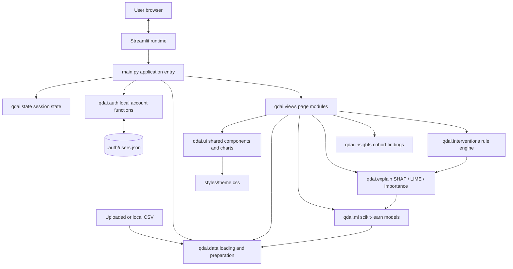
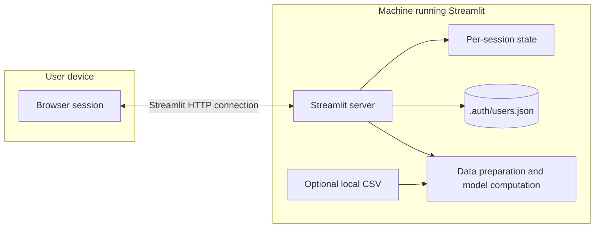
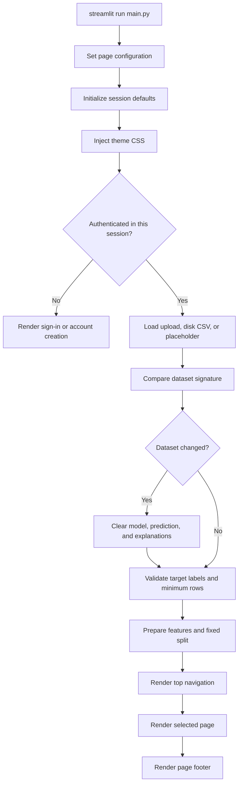
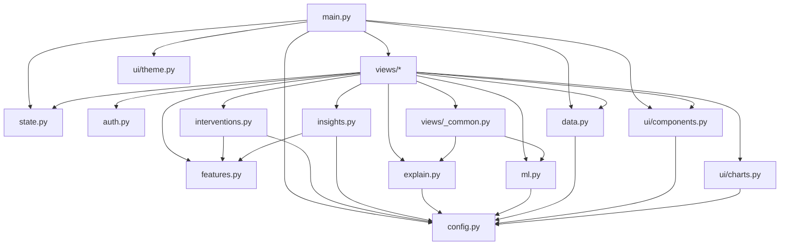
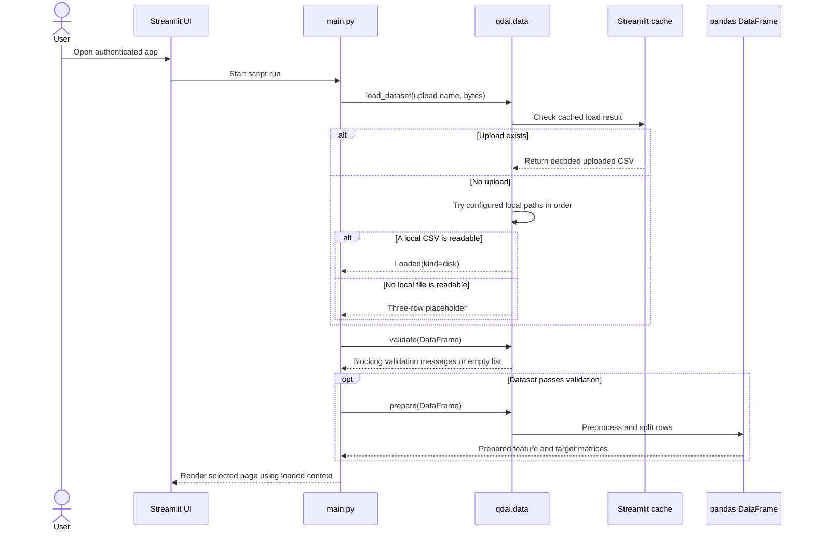
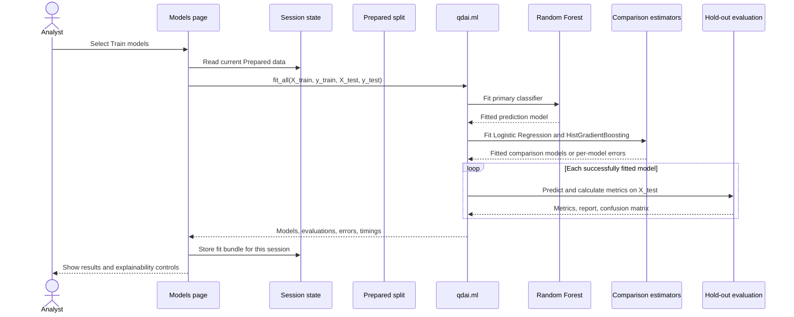
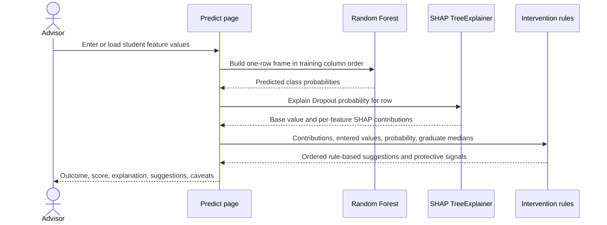
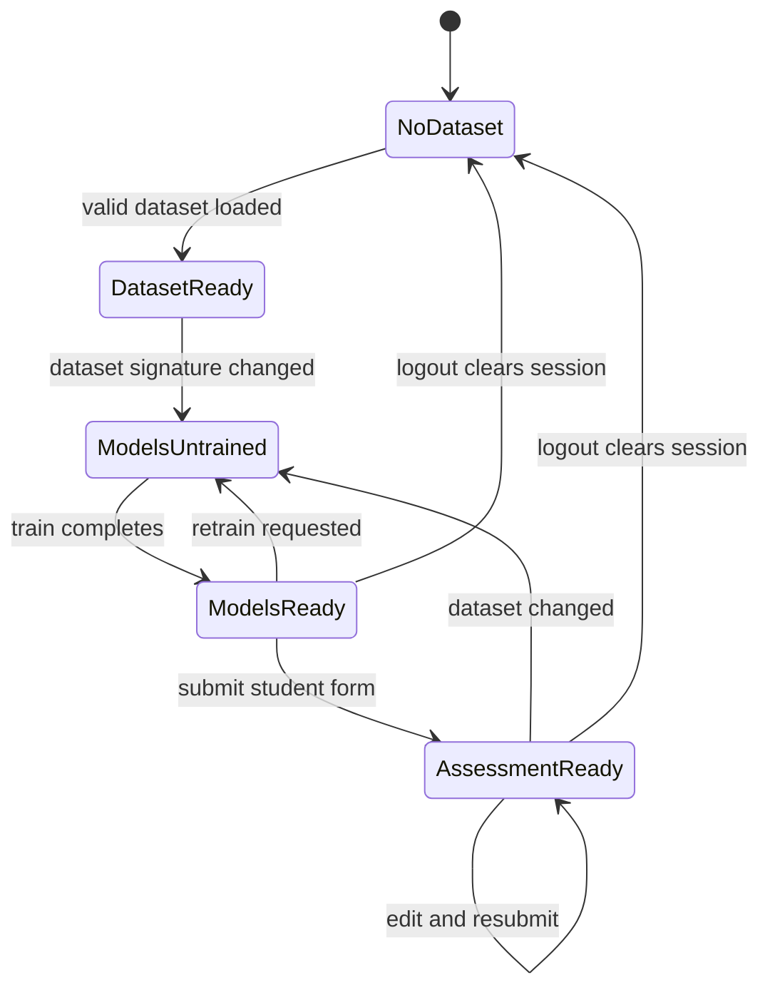
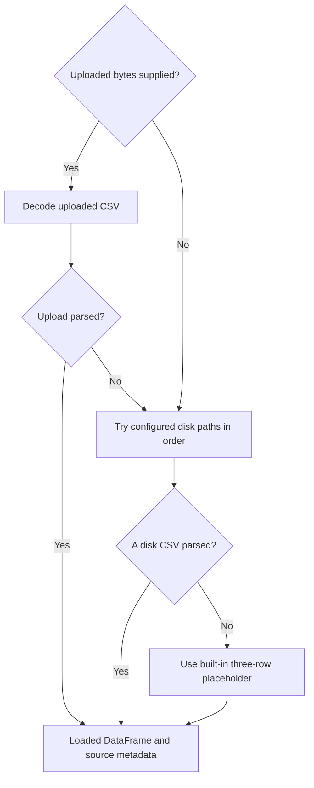

# Quantum_DropOut_AI

Student retention analytics: explore the data, train a model, score a student, see why, and get suggested institutional interventions.

<div align="center">

# Quantum DropOut AI

### Student-retention analytics, built for transparent exploration and review

Explore cohort outcomes, train and evaluate a multiclass model, inspect an individual estimate, and use evidence-linked suggestions to support an advisor's next conversation.

**A Streamlit application · scikit-learn · pandas · SHAP · LIME · Plotly**

</div>

---

## Contents

- [Project at a glance](#project-at-a-glance)
- [Capabilities](#capabilities)
- [Application architecture](#application-architecture)
- [End-to-end workflows](#end-to-end-workflows)
- [Repository map](#repository-map)
- [Requirements and setup](#requirements-and-setup)
- [Dataset contract](#dataset-contract)
- [Data loading and preparation](#data-loading-and-preparation)
- [Modeling and evaluation](#modeling-and-evaluation)
- [Explainability](#explainability)
- [Student-level assessment](#student-level-assessment)
- [Institutional follow-up suggestions](#institutional-follow-up-suggestions)
- [Cohort insights](#cohort-insights)
- [Authentication and session state](#authentication-and-session-state)
- [Pages and user journeys](#pages-and-user-journeys)
- [Configuration](#configuration)
- [Security, privacy, and responsible use](#security-privacy-and-responsible-use)
- [Troubleshooting](#troubleshooting)
- [Known limitations](#known-limitations)
- [Development notes](#development-notes)
- [Glossary](#glossary)

---

## Project at a glance

Quantum DropOut AI is a local-first analytics dashboard for examining student progression outcomes. It turns a tabular student dataset into a sequence of practical tasks: validate and explore the cohort, fit a classifier, evaluate it on held-out rows, assess one student's model-estimated outcome, inspect the contributing signals, and consider a small set of rule-based follow-up ideas.

The project is implemented as one Python application with internal modules, not as a network of independently deployed services. Streamlit runs the interface and application logic in one process. pandas and scikit-learn handle tabular preparation and model fitting. SHAP, LIME, and permutation importance provide model inspection methods. Plotly renders interactive charts.

The product is decision support, not an automated student-management system. It does not contact students, write to a student information system, make enrollment decisions, or send interventions. It does not claim that a feature causes dropout. A staff member must interpret all model outputs in context.

### Current implementation facts

| Area | Implemented behavior |
|---|---|
| Interface | Streamlit app with authenticated Overview, Explore, Models, Predict, and Insights pages |
| Data input | CSV upload or configured local CSV lookup paths; built-in three-row fallback when no file is found |
| Target outcomes | `Dropout`, `Enrolled`, and `Graduate` |
| Primary classifier | Random Forest with fixed project parameters |
| Comparison classifiers | Logistic Regression pipeline and Histogram Gradient Boosting |
| Evaluation | Accuracy, weighted precision/recall/F1, macro one-vs-rest ROC-AUC when defined, classification report, and confusion matrix |
| Individual explanation | SHAP contributions for the Dropout outcome; LIME is available in the Models page for a selected held-out row |
| Cohort explanation | Built-in forest importance, SHAP mean absolute contribution, permutation importance, and partial-dependence-style curves |
| Follow-up ideas | Deterministic rules over feature themes and individual SHAP contributions |
| Local account storage | JSON account file under `.auth/`; PBKDF2-HMAC-SHA256 password hashes |
| Persistence | No database for model state or user records; fitted models and page state are held in Streamlit session state |
| Screenshots | None required by this README |

### Not currently implemented

- A REST API, API gateway, or independently deployable microservice.
- Cloud identity integration, organization-wide role management, or production session management.
- A database, model registry, scheduled retraining pipeline, or durable prediction history.
- Automated email, messaging, case management, payments, or student-system integrations.
- A causal inference engine, calibrated probability model, fairness certification, or automatic intervention delivery.
- A bundled or versioned copy of the student CSV in Git. CSV files are excluded by `.gitignore`.

---

## Capabilities

### Cohort data review

- Load a CSV from the Overview page or a supported local path.
- Inspect record and feature counts, outcomes, missingness, data types, and sample records.
- Explore the distribution of outcomes and rates across student groups.
- Compare numeric distributions and correlations for selected features.
- Browse financial, enrollment, academic, and student-profile signals.
- Review feature-level associations with the binary indicator for the Dropout outcome.

### Model training and review

- Train a Random Forest prediction model on the current dataset split.
- Train two comparison models on the same split where fitting succeeds.
- View elapsed training time and real hold-out metrics.
- Inspect a confusion matrix by counts or row percentages.
- Compare per-outcome precision, recall, F1, and support.
- Compare model-wide feature importance using several available methods.
- Explain the output for a held-out student using SHAP or LIME.
- Explore how averaged predicted probabilities change over a feature grid.

### Individual assessment

- Enter a value for every model input feature.
- Use dataset-derived ranges and defaults for the form controls.
- Load an example from the held-out data and compare the model output with its recorded outcome.
- See all available outcome probabilities and the most likely outcome.
- See the predicted probability of Dropout separately from the three-class winning label.
- Review the strongest SHAP signals and generated rule-based follow-up suggestions.

### Dataset-derived insights

- Show descriptive comparisons only when the required columns and minimum group sizes are present.
- Mark small groups as unreliable for comparison statements.
- Withhold some headline findings when either comparison group has fewer than 30 rows.
- Avoid interpreting arbitrary categorical codes as numeric correlations in the dropout-correlate view.

---

## Application architecture

### Logical component view



The diagram describes Python modules and runtime responsibilities. The arrows do not represent network calls. There is no service-to-service transport in the current application.

### Runtime and trust boundaries



This is not a hardened multi-tenant deployment architecture. A person with access to the app host can access files available to the host process. Anyone with access to a shared app URL may be able to create a local account unless access is restricted outside the application.

### Startup and page routing



The entry point stores the current dataset signature using source kind, source identifier, and row count. A detected signature change invalidates the trained-model state. Because the signature is intentionally small, it is not a cryptographic fingerprint of file contents.

### Source dependency view



### Component responsibilities

| Component | Responsibility |
|---|---|
| `main.py` | Configure Streamlit, initialize state, enforce the auth gate, load and validate data, reset stale model state, route to the selected view |
| `qdai/config.py` | Central target mapping, data paths, split and model parameters, risk thresholds, colors, auth constants, and page names |
| `qdai/state.py` | Initialize session keys and implement page navigation, model reset, and logout callbacks |
| `qdai/auth.py` | Validate registration, hash passwords, persist local accounts, authenticate sign-ins, and track a per-session lockout |
| `qdai/data.py` | Read CSVs, provide placeholder data, validate the target, preprocess features, create the split, and compute dataset summaries |
| `qdai/features.py` | Describe known features, form sections, value labels, feature domains, and fallback widget types |
| `qdai/ml.py` | Fit models, produce multiclass predictions, calculate hold-out metrics, and construct a one-row prediction frame |
| `qdai/explain.py` | Adapt SHAP output shapes and calculate local/global SHAP, LIME, permutation importance, built-in importance, and feature curves |
| `qdai/insights.py` | Calculate rates, data-derived findings, correlations, group reliability, graduate medians, and transparent risk flags |
| `qdai/interventions.py` | Convert positive Dropout SHAP contributions and explicit student values into deterministic advisor suggestions |
| `qdai/views/` | Implement authentication, navigation shell, Overview, Explore, Models, Predict, and Insights pages |
| `qdai/views/_common.py` | Reuse the primary model, cache a SHAP explainer in session state, and gate model-dependent views |
| `qdai/ui/components.py` | Shared HTML wrappers, page headings, notices, summary strips, and risk labels |
| `qdai/ui/charts.py` | Build Plotly charts for cohort exploration, evaluation, and explanations |
| `qdai/ui/theme.py` | Inject the local CSS design system and reset scroll position after page changes |
| `styles/theme.css` | Application typography, color tokens, page layout, controls, and responsive styles |
| `legacy/main_original.py` | Preserved original single-file application; not the current entry point |

---

## End-to-end workflows

### Dataset-to-dashboard flow



### Model training flow



### Individual assessment flow



### Prediction state machine



The three-row built-in placeholder is intentionally too small to pass the normal dataset validation threshold. The UI may describe its presence, but meaningful training requires a valid uploaded or local dataset with at least ten rows.

---

## Repository map

```text
Quantum_DropOut_AI/
├── main.py                       Streamlit entry point and page router
├── requirements.txt              Runtime dependencies
├── README.md                     Project and operations guide
├── .gitignore                    Excludes local auth data, virtualenv, bytecode, and CSV files
├── .streamlit/
│   └── config.toml               Theme, static serving, upload limit, and browser settings
├── data/
│   └── .gitkeep                  Keeps the expected local data directory in Git
├── legacy/
│   └── main_original.py          Preserved earlier monolithic app
├── qdai/
│   ├── __init__.py
│   ├── auth.py                   Local account creation and sign-in
│   ├── config.py                 Shared constants and model parameters
│   ├── data.py                   CSV loading, validation, preprocessing, splitting
│   ├── explain.py                SHAP, LIME, and feature-importance helpers
│   ├── features.py               Feature metadata and prediction-form behavior
│   ├── insights.py               Descriptive analyses and group-size guards
│   ├── interventions.py          Evidence-linked follow-up rules
│   ├── ml.py                     Classifier fitting and evaluation
│   ├── state.py                  Per-browser-session state and callbacks
│   ├── ui/
│   │   ├── __init__.py
│   │   ├── charts.py             Plotly figure builders
│   │   ├── components.py         Shared UI helpers
│   │   └── theme.py              CSS injection and scroll handling
│   └── views/
│       ├── __init__.py
│       ├── _common.py            Shared model and explainer access
│       ├── explore.py            Cohort exploration chapters
│       ├── insights.py           Findings and held-out risk distribution
│       ├── login.py              Sign-in and account creation
│       ├── models.py             Training, evaluation, explainability
│       ├── overview.py           Dataset selection and summary
│       ├── predict.py            Individual risk assessment
│       └── shell.py              Navigation and account menu
├── static/
│   ├── Manrope.ttf               Locally served Manrope font
│   └── OFL-Manrope.txt           Font license text
└── styles/
  └── theme.css                 App-wide design system
```

The `.auth/` folder is created at runtime and ignored by Git. It contains local account data and should not be committed. The CSV under `data/` is also ignored; the directory is represented in a fresh clone by `.gitkeep` only.

---

## Requirements and setup

### Prerequisites

- Python 3.10 or later is recommended; the current project has been tested with Python 3.12.
- Git, if cloning the repository.
- A modern browser supported by Streamlit.
- A CSV conforming to the [dataset contract](#dataset-contract) for useful analysis.

The UI and CSS were tested with Streamlit 1.64. The dependency file sets lower bounds rather than exact lock versions, so a newly resolved environment may use newer releases.

### Clone and create an isolated environment

```bash
git clone https://github.com/kishankarthik0607/Quantum_DropOut_AI.git
cd Quantum_DropOut_AI

python -m venv .venv
```

Activate the environment:

```bash
# Windows PowerShell
.\.venv\Scripts\Activate.ps1

# macOS or Linux
source .venv/bin/activate
```

Install the declared packages:

```bash
python -m pip install --upgrade pip
python -m pip install -r requirements.txt
```

### Provide a dataset

Choose one of the following:

1. Place a CSV at `data/student_dropout_data.csv`.
2. Start the app and upload a CSV on the Overview page.

The data directory is not populated by a fresh clone. The project `.gitignore` excludes `data/*.csv`; provide an appropriately authorized dataset locally. The app also checks historical absolute and relative paths in the order listed in `qdai/config.py` before using its built-in placeholder.

### Run the app

Run from the repository root so that project-level Streamlit configuration is discovered:

```bash
streamlit run main.py
```

Streamlit prints a local URL, typically `http://localhost:8501`.

### First sign-in

On first launch, choose **Create account**, provide a name and email, and create a password with at least eight characters including a letter and a digit. The app signs the new account in immediately. Accounts are stored on the machine running Streamlit, not in a cloud identity provider.

### Stop the app

Use `Ctrl+C` in the terminal running Streamlit.

---

## Dataset contract

### Required target

The input must contain a column named `Target`. The accepted, case-sensitive values are:

| Raw value | Internal class id |
|---|---:|
| `Dropout` | `0` |
| `Graduate` | `1` |
| `Enrolled` | `2` |

The raw target is categorical. Do not provide pre-encoded numeric class IDs in place of the named values.

### Row and column expectations

- At least ten rows are required by the application validation gate.
- Each row represents one student record.
- Columns other than `Target` and an optional `id` column are treated as model inputs after preprocessing.
- Column names are stripped of surrounding whitespace when the CSV is read.
- Unknown input columns are retained and exposed in the prediction form under **Additional signals**.
- The application does not enforce one fixed feature schema. Available columns drive the form and model matrix.
- A usable input column must become numeric after encoding/conversion or be handled as described in [Data loading and preparation](#data-loading-and-preparation).

### CSV reader behavior

- UTF-8 with a byte-order mark is attempted first.
- Latin-1 is attempted if UTF-8 decoding fails.
- If the first parse produces a single column whose header contains semicolons, the file is retried with `;` as the delimiter.
- Surrounding whitespace is stripped from header names.
- Streamlit's upload limit is configured as 200 MB in `.streamlit/config.toml`.

### Dataset privacy

The application dataset in a developer's local `data/` directory is ignored by Git. Do not remove that safeguard merely to make the README show sample records. Before uploading data, confirm that local policy, consent, and access controls permit this use. Avoid including direct identifiers or sensitive information that is not needed for the analysis.

---

## Data loading and preparation

### Source selection order



`Loaded.kind` records whether the active source is `upload`, `disk`, or `placeholder`. This lets the views warn when a chart or model would describe the fallback data rather than the intended cohort.

### Validation

The blocking checks in `qdai.data.validate` are:

- The `Target` column exists.
- Every non-null target value is one of the three supported outcome strings.
- The DataFrame contains at least ten rows.

Validation is deliberately small and does not certify statistical suitability, representativeness, or data provenance. It does not enforce that all three classes are represented in both training and test partitions.

### Preprocessing sequence

```mermaid
flowchart LR
  Raw[Raw DataFrame]
  Trim[Strip whitespace from column names]
  DropId[Drop id column if present]
  Impute[Fill numeric missing values with column median]
  Encode[Label-encode text columns except Target]
  Map[Map named Target outcomes to integer IDs]
  Numeric[Convert remaining columns to numeric]
  DropRows[Drop rows still containing missing values]
  Features[X feature matrix]
  Labels[y target series]
  Split[80 percent train / 20 percent test]
  Raw --> Trim --> DropId --> Impute --> Encode --> Map --> Numeric --> DropRows
  DropRows --> Features
  DropRows --> Labels
  Features --> Split
  Labels --> Split
```



Important details:

- Numeric imputation uses the median calculated over the loaded dataset before the train/test split.
- Text columns other than `Target` are encoded using `LabelEncoder`, one column at a time.
- Encoders are not persisted as a reusable inference artifact. The prediction form is built from the already-prepared numeric dataset values.
- `Target` values are mapped through the target mapping. The preprocessing function fills unmapped target values with class `0`; validate and clean null or malformed target labels before using a dataset.
- All columns are converted with `pandas.to_numeric(errors="coerce")` after text encoding.
- Rows that still contain null values after conversion are dropped.
- The optional `id` feature is removed before modeling.
- The split is `train_test_split(test_size=0.2, random_state=42)` with no stratification argument.

Because imputation is calculated before splitting, information from the held-out feature distribution contributes to the imputation medians. For rigorous model validation, fit imputation and categorical transformations only on training data inside a scikit-learn pipeline, then apply those transformations to validation and production records.

### Prepared dataset object

`qdai.data.prepare` returns a `Prepared` data object containing:

| Attribute | Contents |
|---|---|
| `X` | All preprocessed model input features |
| `y` | Encoded target classes |
| `processed` | Processed DataFrame including the target |
| `X_train` | Training input matrix |
| `X_test` | Hold-out input matrix |
| `y_train` | Training labels |
| `y_test` | Hold-out labels |
| `dropped_rows` | Count of input rows removed by post-conversion missing-value drop |

The object is cached by Streamlit's data cache. The cached object is used within the current local app session and is not a model registry or durable storage layer.

---

## Modeling and evaluation

### Primary model

Random Forest is the sole prediction engine used by the Predict page. The current parameters in `qdai/config.py` are:

| Parameter | Value |
|---|---:|
| `n_estimators` | `200` |
| `max_depth` | `None` |
| `min_samples_split` | `5` |
| `min_samples_leaf` | `2` |
| `class_weight` | `balanced` |
| `random_state` | `42` |
| `n_jobs` | `-1` |

### Comparison models

- **Logistic Regression** is placed after `StandardScaler` in a scikit-learn pipeline, uses `max_iter=2000`, balanced class weights, and `random_state=42`.
- **Gradient Boosting** is implemented with `HistGradientBoostingClassifier`, balanced class weights, and `random_state=42`.
- A baseline model fitting error is recorded per model and does not prevent the primary Random Forest from being used.
- Comparison models provide context in the Models page. They are not used to produce an individual prediction or the related SHAP explanation.

### Evaluation protocol

1. The data module creates one fixed 80/20 split using random state 42.
2. Each selected estimator is fit on the training partition.
3. Predictions and probabilities are calculated on the hold-out partition.
4. Metrics are recomputed from those predictions; they are not hard-coded or copied from a previous run.
5. The Models page labels the Random Forest as the prediction engine and the other estimators as comparisons.

### Metrics

| Metric | Meaning in this app |
|---|---|
| Accuracy | Fraction of hold-out examples whose predicted class equals the recorded class |
| Precision | Weighted average precision over classes, with zero division set to zero |
| Recall | Weighted average recall over classes, with zero division set to zero |
| F1 | Weighted average F1 over classes, with zero division set to zero |
| ROC-AUC | Macro one-vs-rest multiclass ROC-AUC when the hold-out class/probability shape supports calculation; otherwise `n/a` |
| Classification report | Per-class precision, recall, F1, and support from scikit-learn |
| Confusion matrix | Actual versus predicted class counts in model class order |

Weighted averages account for each class's support in the hold-out set. A good aggregate metric does not guarantee acceptable performance for every class or subgroup. Inspect the per-class report and confusion matrix before interpreting the model.

### Retraining and invalidation

- Training occurs when an authorized user clicks **Train models** or **Retrain models** on the Models page.
- Fitted estimators and metrics are stored in the current Streamlit session.
- Changing the dataset signature resets model, prediction, sample, and explanation state.
- Logging out clears the current session state.
- Restarting the process does not restore a trained model from durable storage.

### Model result interpretation

The classifier predicts one of three outcomes. The Predict page additionally reports `P(Dropout)` as a risk score. The predicted class is the outcome with the largest class probability; the dropout risk band is a separate presentation of the Dropout probability.

The model has not been shown to be calibrated. A 70% predicted probability should be read as the model's score for this record, not as a validated statement that exactly 70 out of 100 similar students will drop out.

---

## Explainability

### Local SHAP explanation

For a student prediction, the app requests the SHAP values corresponding specifically to the Dropout class. The class index is resolved from the fitted estimator's `classes_` array and the configured target mapping. This avoids treating a class position as if it were always the same semantic outcome.

The Random Forest TreeExplainer contributions are displayed in probability units. The app reports the base value and sums all feature contributions to compare with the model's Dropout probability. The strongest eight contributions are drawn in the visual explanation; all available contribution rows participate in the total.

| Sign of SHAP value | Display interpretation for Dropout |
|---|---|
| Positive | Pushes the model output toward a higher Dropout probability for this prediction |
| Negative | Pushes the model output toward a lower Dropout probability for this prediction |

Contributions describe how the fitted model decomposes its output. They do not establish causal effects or prove that changing a feature will change a student's outcome.

### Global feature importance options

| Method | Current implementation | What it can and cannot say |
|---|---|---|
| Built-in importance | Random Forest `feature_importances_` | Measures the model's impurity-based feature use; it can favor features with many possible split points |
| SHAP | Mean absolute SHAP values, sampled from up to 100 training rows | Summarizes average contribution magnitude; all-class mode averages magnitudes across the model classes |
| Permutation | Five shuffles per feature on the test partition, random state 42 | Measures the change in accuracy when a feature is shuffled; correlated features can affect interpretation |
| LIME | Local surrogate around a selected held-out record | Approximates a local decision with a simpler model; results can vary with the neighborhood and feature representation |
| Partial dependence | Average predicted probabilities while a feature is swept across a 40-point observed range | Shows model response averaged over up to 100 held-out rows; it is not a causal effect and can include implausible feature combinations |

SHAP and LIME are optional dependencies at runtime. If explanation generation fails, the page reports the issue and may show available built-in feature importance instead.

### Explainability scope

- Local SHAP in Predict is aimed at the Dropout outcome because follow-up rules use dropout-directed contributions.
- The Models page can use SHAP or LIME to explain a selected held-out example for the chosen class.
- The Models page exposes global SHAP for all outcomes or Dropout only.
- Permutation importance is calculated using the hold-out data and model scoring behavior.
- The app does not explain a comparison model on the Predict page.

---

## Student-level assessment

### Form construction

The form takes its feature list and numeric ranges from the prepared dataset. Known fields use the feature registry in `qdai/features.py`; additional dataset columns are not silently discarded and appear under **Additional signals**.

Known fields are grouped into:

| Form section | Examples |
|---|---|
| Academic profile | Admission grade, qualification, application mode, course, attendance schedule |
| Student profile | Age at enrollment, gender, marital status, nationality, international status, displacement |
| Socioeconomic context | Fees, debt, scholarship, parental qualifications and occupations, national indicators |
| Academic progress | First- and second-semester enrolled, evaluated, approved, credited, and unevaluated units; semester grades |

Binary controls use registered labels where available. Code-valued fields use the dataset's observed values. Code labels are only provided for explicitly documented values; other values are shown as `Code N` rather than guessed.

### Example records

The buttons **Load a real student**, **Example: dropout**, and **Example: graduate** populate the form from the hold-out partition. Those values remain editable. When the submitted values still match the selected example, the UI can show the recorded outcome alongside the prediction.

### Output

An assessment can display:

- The highest-probability outcome among Dropout, Enrolled, and Graduate.
- The probability for each available class.
- The Dropout probability as a separate score and a Low, Medium, or High presentation band.
- A local SHAP explanation for the Dropout probability.
- Rule-based interventions and protective signals when the explanation is available.
- A warning or fallback feature-importance view if a local SHAP explanation cannot be generated.

Risk bands use fixed application thresholds: Low is below 30%, Medium is from 30% to below 60%, and High is 60% or higher. These are not learned, optimized, or calibrated cut-offs.

---

## Institutional follow-up suggestions

The intervention engine in `qdai/interventions.py` is deterministic application logic. It combines the current student's values, positive SHAP contributions toward Dropout, feature-to-domain mappings, and explicit rules. It does not call a language model or generate free-form advice.

### Themes

| Theme | Example evidence considered | Example suggested follow-up |
|---|---|---|
| Academic support | Low approved/enrolled unit ratio, grades below the graduate median, units without evaluation, positive progress-domain contribution | Advisor follow-up and consideration of tutoring or structured study support |
| Financial support | Tuition not current, recorded debt, scholarship status, positive financial contribution | Review scholarship eligibility, payment plans, or financial support options |
| Mentoring and engagement | Age at enrollment, displacement, recorded educational special needs, positive profile contribution | Offer an advisor or peer mentor and check in on workload and transition |
| Programme fit review | Application order, admission grade relative to graduate median, schedule, positive pathway contribution | Discuss programme fit, workload, or alternative pathways with an academic advisor |

### Trigger rules

- Academic, profile, and pathway themes require at least a 0.02 summed positive contribution to the Dropout probability.
- The financial theme is also eligible when fees are not current or debt is recorded and the Dropout probability is at least the Low-band boundary (0.30).
- Financial rules are explicit policy choices in code and should be reviewed before use by an institution.
- Suggested items are ordered by their positive contribution push and assigned display priorities.
- Family and national-economy contributions may be shown as context, but those themes do not create an institutional action in this implementation.
- Negative contributions are presented separately as protective model signals.
- If no theme stands out at higher risk, the app suggests a general advisor check-in in its explanatory copy; it does not create or schedule an actual task.

### Limits of the rules

The rules do not establish eligibility, student need, treatment effectiveness, or causation. A positive SHAP contribution is conditional on this fitted model and record. Staff should verify the underlying information and ask the student about their situation before acting. The suggested actions are not clinical or psychological advice.

---

## Cohort insights

The **Explore** and **Insights** pages calculate results from the currently loaded DataFrame. Findings are descriptive and are worded as associations or within-dataset comparisons, not causal conclusions.

### Group rates

For a selected group, dropout rate is calculated as the number of rows with `Target == "Dropout"` divided by the number of non-null group rows. The app reports group sizes and marks groups with fewer than 30 rows as unreliable for comparison statements.

### Headline finding safeguards

- Minimum group-size checks use `MIN_GROUP_N = 30`.
- Some comparisons require both groups to meet that minimum.
- A headline finding is omitted when required columns, comparison groups, or sample counts are unavailable.
- Feature correlations with the Dropout indicator omit ID/target fields, constant columns, and known code-valued fields whose integer labels have no linear numeric meaning.
- Other numeric correlations remain descriptive and do not imply causal influence.
- Correlation strength and group rates can be unstable under selection effects, confounding, or changes in cohort composition.

### Insights page sections

- **Key findings:** computed comparisons for tuition, scholarship, semester units, or age when conditions permit.
- **Dropout drivers:** numeric associations with the dropout indicator and, after training, Random Forest built-in importance.
- **Academic trends:** dropout rate by grouped approved-unit counts.
- **Financial indicators:** dropout rates by fee status, debt, and scholarship status.
- **Enrollment patterns:** age groups, schedule, and application order.
- **Risk distribution:** after training, predicted probabilities for the held-out set grouped using the display bands.

The risk distribution uses the trained model on the same hold-out partition used for evaluation. It is not a prospectively collected population estimate.

---

## Authentication and session state

### Account creation and password storage

- The local account store is `.auth/users.json` under the project root.
- Registration normalizes email addresses to lowercase and validates a simple email shape.
- Passwords must be at least eight characters and contain at least one letter and one digit.
- Each account receives a random 16-byte salt.
- Password hashes use PBKDF2-HMAC-SHA256 with 240,000 iterations.
- Password comparison uses `hmac.compare_digest`.
- The JSON file is replaced atomically after writing a temporary file in the same directory.
- The app attempts to restrict file permissions to owner read/write where supported by the operating system.

### Sign-in protection

- Authentication always performs one PBKDF2 operation, including for an unknown account, to reduce account-enumeration timing differences.
- After five failed attempts, that browser session is locked for 30 seconds.
- Failed-attempt counters are held in Streamlit session state, not in a shared server-side rate-limit store.
- The lockout does not prevent a determined attacker from starting another browser session or targeting the JSON file directly.

### Session lifecycle

- Authentication state, page selection, current uploaded bytes, trained models, prediction results, and explanation cache are session state.
- A browser refresh can create a new Streamlit session and require sign-in again.
- Logging out deletes all keys from the current session.
- Local accounts remain in `.auth/users.json` after sign-out and process restart.
- Deleting `.auth/` removes all locally stored accounts and allows a new local account to be created.

This authentication design is suitable only for a controlled local demonstration. For deployment to real users, use a managed identity system such as Streamlit's supported OIDC flow and protect access at the hosting layer.

---

## Pages and user journeys

### Overview

The Overview page presents the current dataset source, headline cohort counts, outcome shares, a CSV uploader, dataset validation messages, a short workflow summary, and up to two computed headline findings. Upload a replacement file here; the app notices the new source and resets any model fit associated with the previous dataset.

### Explore

The Explore page groups descriptive analysis into chapters:

1. **Outcomes**: outcome distribution and outcome shares by selected binary factors.
2. **Student profile**: age distributions and demographic or enrollment-group dropout rates.
3. **Academic performance**: admission and semester-grade distributions, plus approved-unit and grade comparisons.
4. **Enrollment patterns**: schedule, application order, course, and application mode.
5. **Financial indicators**: fee status, debt, scholarships, and simple transparent flags.
6. **Relationships**: selected numeric distributions and correlation heatmap.
7. **Data quality**: completeness, data types, uniqueness, summary statistics, and sample rows.
8. **Feature lab**: selected feature values, rates across numeric bins, and within-group summaries.

Charts are built from the active DataFrame. The page does not train a model as a side effect.

### Models

The Models page is the only place to start or retrain model fitting. Its sections include:

- Training status, dataset size, feature count, split sizes, and elapsed time.
- Metrics for Random Forest and any successfully trained comparison model.
- Confusion matrix with count or row-percentage display.
- Per-outcome report.
- Random Forest built-in importance.
- Global importance using built-in importance, SHAP, or permutation.
- Local held-out-record explanation using SHAP or LIME.
- Feature-impact curves based on partial dependence.

The app caches some explanations in the current session to avoid repeating expensive computations during reruns. Retraining clears the relevant explainer and explanation cache.

### Predict

Prediction is available after training. The page validates that a dataset is ready, gates on the current session's fitted model, builds controls from all model features, and renders the prediction and its explanation after form submission.

Changing form fields alone does not run the analysis; submit the form using **Analyze student**. **Reset form** clears stored form values and the current result.

### Insights

The Insights page combines cohort-level descriptions with trained-model information when available. Cohort findings can be reviewed before training; Random Forest importance and held-out risk distribution require a trained model.

### Login and navigation shell

Unauthenticated sessions see sign-in and account creation. Authenticated sessions use the fixed top navigation and account menu. The navigation routes to Overview, Explore, Models, Predict, and Insights. The footer repeats the page links.

---

## Configuration

### Application constants

Most behavior-changing values live in `qdai/config.py`:

| Setting | Current value | Purpose |
|---|---:|---|
| `TEST_SIZE` | `0.2` | Fraction assigned to the hold-out set |
| `RANDOM_STATE` | `42` | Reproducible split and model random state where supported |
| `RISK_LOW_MAX` | `0.30` | Upper boundary of the Low display band |
| `RISK_HIGH_MIN` | `0.60` | Start of the High display band |
| `MIN_GROUP_N` | `30` | Minimum group count for selected comparisons |
| `INTERVENTION_MIN_PUSH` | `0.02` | Positive probability contribution threshold for several action themes |
| `PBKDF2_ITERATIONS` | `240000` | Local password-hashing iteration count |
| `MAX_FAILED_LOGINS` | `5` | Failed sign-ins before the session lockout |
| `LOCKOUT_SECONDS` | `30` | Session lockout duration |

### Streamlit configuration

`.streamlit/config.toml` currently:

- Sets the dark base theme and primary/background colors.
- Enables static serving for `static/` assets.
- Sets the upload limit to 200 MB.
- Hides Streamlit's standard sidebar navigation and uses a minimal toolbar.
- Disables browser usage-stat collection.

The CSS in `styles/theme.css` styles Streamlit elements using DOM selectors and `data-testid` attributes. Those selectors are implementation details of Streamlit and may change across versions. If an upgrade changes the UI, review the CSS against the installed Streamlit release.

### Environment variables and secrets

The current app has no required environment variables and does not call an external database or API. Do not add secrets to the source tree. If future integrations require credentials, use the hosting platform's secret mechanism rather than committing credentials to Git.

---

## Security, privacy, and responsible use

### Data handling checklist

- Confirm that the dataset is authorized for this purpose.
- Use the minimum necessary features and remove direct identifiers where possible.
- Keep CSVs out of commits; the current `.gitignore` excludes `data/*.csv`.
- Restrict access to the host machine and any network exposure of Streamlit.
- Treat uploaded records and the local account file as sensitive files on the app host.
- Delete local uploads or records according to the institution's retention requirements.
- Do not use this prototype as the sole basis for a consequential decision about an individual student.

### Model and explanation safeguards

- Risk bands are presentation thresholds, not validated intervention thresholds.
- Predicted probabilities are not described as calibrated probabilities.
- Dataset-derived rates and correlations are not causal evidence.
- SHAP and LIME explain model behavior, not the student's underlying circumstances or future with certainty.
- Group-size guards do not eliminate bias, confounding, measurement error, or selection bias.
- The model may encode historical inequities, and the app does not include a fairness audit.
- A missing explanation does not mean there is no risk or no relevant context.
- Verify data quality and discuss the record with the student before acting.

### Authentication safeguards and limits

The app hashes passwords, but its local JSON store, session-local lockout, and transient browser session are not a substitute for a production identity and access management system. Do not expose this prototype publicly with real student records without adding appropriate identity, authorization, transport security, monitoring, data retention, and incident response controls.

---

## Troubleshooting

### The app says it cannot find a dataset

Place a CSV at `data/student_dropout_data.csv` or upload it on Overview. A fresh clone contains only `data/.gitkeep`; CSV files are not committed. If no file is found, a three-row placeholder is loaded and blocked from normal use by the minimum-row check.

### The uploaded file appears as one column

The loader retries semicolon-delimited CSVs when the first read produces one header containing semicolons. Confirm the file is a valid CSV and that its delimiter is consistent throughout the file.

### The target column is rejected

Use a header exactly named `Target` and values exactly `Dropout`, `Enrolled`, or `Graduate`. The loader strips surrounding whitespace from header names, but target values themselves are case-sensitive and are not normalized.

### Training fails on a very small or imbalanced dataset

The minimum row count is ten, not a guarantee that every class is sufficiently represented. The non-stratified split may leave one class missing from a partition. Use a larger, appropriately sampled dataset and review the class distribution before interpreting metrics.

### ROC-AUC shows `n/a`

ROC-AUC is omitted when scikit-learn cannot calculate multiclass one-vs-rest ROC-AUC from the hold-out labels and probability matrix, for example when a class is absent from the test set.

### SHAP or LIME is slow or unavailable

Global and local explanations can require additional computation. The app caches selected explanations in session state, but they are lost when the session ends or the model is retrained. Check the terminal for the displayed exception and use another available importance method if needed.

### A user cannot sign in after repeated mistakes

Wait for the 30-second session lockout to expire. The lockout counter is per browser session and resets after a successful sign-in. If the local account store cannot be read, inspect `.auth/users.json`; deleting `.auth/` resets all accounts and should only be done when that is intended.

### Styling looks wrong after a Streamlit upgrade

The custom CSS targets Streamlit DOM elements and test IDs. Check the installed Streamlit version and compare the affected selectors in `styles/theme.css` with the current rendered DOM. The project was tested with Streamlit 1.64.

### Font does not load

The stylesheet references a locally served Manrope font and includes a Google Fonts import as a fallback. Confirm that `static/Manrope.ttf` exists and static file serving is enabled in `.streamlit/config.toml`. A network policy may block Google Fonts, but the local font should remain available when static serving works.

---

## Known limitations

1. The train/test split is not stratified and is not a cross-validation protocol.
2. Median imputation is calculated before the split; use a fitted preprocessing pipeline for leakage-resistant evaluation.
3. Text categories are encoded with per-column `LabelEncoder`; nominal category ordering is not modeled as a dedicated categorical transformer.
4. Unknown/missing target handling in preprocessing should be cleaned and reviewed before use; the safest input has no null or unrecognized target values.
5. No probability calibration or threshold optimization is performed.
6. The prediction form expects values represented by the prepared training columns and does not persist a separate preprocessing artifact.
7. The dataset signature used for model invalidation is source metadata plus row count, not a full content hash.
8. A minimum of ten rows is a technical gate, not a statistical adequacy criterion.
9. Small subgroups can be suppressed in selected comparisons, but no comprehensive fairness or privacy audit is included.
10. A single model fit is held in session state and disappears when that session is cleared.
11. Local authentication is not organization-grade identity management.
12. No automated tests are currently included in the tracked repository.
13. The CSS depends on Streamlit selectors and should be reviewed after dependency upgrades.
14. Some dataset category codes do not have documented display labels and are shown numerically.
15. The app has no role-based authorization beyond the sign-in gate; every registered local account can access the same application pages.

---

## Development notes

### Dependency list

`requirements.txt` declares:

- `streamlit` for the app runtime and widgets.
- `pandas` and `numpy` for tabular data operations.
- `scikit-learn` for preprocessing, classifiers, and evaluation.
- `scipy` for optional density estimation in a chart.
- `plotly` for interactive charts.
- `shap` for tree-based feature attributions.
- `lime` for local surrogate explanations.

The legacy single-file app has optional historical plotting dependencies noted in comments in the requirements file; they are not required for the current modular entry point.

### Useful commands

```bash
# Launch the current application from the repository root
streamlit run main.py

# Inspect dependency versions in the active environment
python -m pip show streamlit pandas scikit-learn shap lime plotly

# Check the repository worktree
git status --short --branch
```

### Code organization conventions

- Keep data, model, explainability, insight, and intervention logic in `qdai/` modules rather than page markup.
- Keep Streamlit page composition under `qdai/views/`.
- Keep shared chart construction in `qdai/ui/charts.py` and shared UI elements in `qdai/ui/components.py`.
- Put behavior-changing thresholds and mappings in `qdai/config.py` where practical.
- Keep displayed metrics computed from current data and predictions; do not hard-code cohort results.
- Preserve the distinction between descriptive associations, predictive signals, and intervention rules.
- Do not check in `.auth/`, virtual environments, bytecode caches, or student CSV files.

### Suggested validation before a release

- Install dependencies in a clean virtual environment.
- Launch from the repository root and confirm the Streamlit configuration is applied.
- Verify account creation, sign-in, logout, and a browser refresh.
- Check a valid CSV, an invalid target, a missing target, malformed numeric input, and a small dataset.
- Train the Random Forest and inspect class support in both partitions.
- Compare displayed metrics with the held-out predictions.
- Test a local SHAP explanation and a LIME explanation.
- Change the loaded dataset and confirm the fitted model is invalidated.
- Confirm CSV data and `.auth/` remain untracked.
- Review group-size and responsible-use text before demonstrating results.

---

## Glossary

| Term | Meaning in this project |
|---|---|
| Actual outcome | The `Target` value recorded in a dataset row |
| Baseline model | One of the comparison estimators, not used for Predict-page scoring |
| Class probability | The fitted estimator's predicted probability for one outcome class |
| Cohort | The rows currently present in the loaded dataset |
| Confusion matrix | A table comparing actual labels with predicted labels |
| Dropout risk score | The model's predicted probability for the Dropout class |
| Feature | A model input column after preprocessing, excluding `Target` and optional `id` |
| Hold-out set | The 20% partition excluded from fitting and used for evaluation |
| Intervention | A deterministic suggestion for an institutional follow-up, not an executed action |
| Label encoding | Mapping text categories to numeric integers before model fitting |
| Local explanation | A description of signals for one model prediction |
| Macro one-vs-rest ROC-AUC | Mean per-class ROC-AUC computed by treating each class as positive in turn |
| Model calibration | Agreement between predicted probabilities and observed frequencies; not evaluated here |
| Multiclass classification | Selecting among Dropout, Enrolled, and Graduate labels |
| Placeholder | A small built-in sample DataFrame used when no CSV can be loaded |
| Positive SHAP contribution | A contribution that increases the model's Dropout output for this record |
| Prepared data | Processed feature/target values and the current train/test partitions |
| Probability calibration | A separate model post-processing step that is not performed in this app |
| Risk band | A fixed Low, Medium, or High label derived from configured score thresholds |
| Session state | Per-browser-session values managed by Streamlit |
| Target | The required outcome column, containing one of the accepted outcome names |
| Training set | The 80% partition used to fit model parameters |
| Weighted metric | A class metric averaged with each class's sample support as its weight |

---

## License and attribution

No project software license is declared in the tracked repository at the time this README was written. Confirm the repository's intended license before redistributing the application. The Manrope font license text is included at `static/OFL-Manrope.txt`; review that file for font-specific terms.

---

<div align="center">

Built with Python and Streamlit for careful, explainable student-retention analysis.

</div>

---

## Technical appendices

The following appendices provide implementation-oriented reference material for operators, reviewers, and contributors. They document expected inputs and verification steps; they do not expand the guarantees or capabilities of the model.

### Appendix A: feature reference

The names below are the source columns used by the project's feature registry and sample dataset. The loaded dataset determines which controls appear. Fields omitted from a particular dataset are not fabricated by the interface.

#### `id`

- Role: optional row identifier in a source extract.
- Model input: no; preprocessing removes this field when present.
- Prediction control: no.
- Validation: no uniqueness check is currently performed.
- Review note: do not use an identifier as a proxy feature.
- Privacy note: remove direct identifiers before loading student records.

#### `Target`

- Role: observed outcome label used as the supervised-learning target.
- Model input: no; it becomes the label series `y`.
- Accepted labels: `Dropout`, `Enrolled`, and `Graduate`.
- Encoding: mapped to internal integer values 0, 2, and 1 respectively.
- Validation: required, case-sensitive, and checked for unknown non-null labels.
- Review note: verify outcome timing and definition before comparing cohorts.

#### `Marital status`

- Role: coded student-profile field.
- Model input: yes, unless absent from the dataset.
- Form behavior: dataset-observed values are offered as a code selector.
- Display behavior: some documented codes use labels; other codes show `Code N`.
- Preprocessing: numeric codes remain numeric; text categories are encoded.
- Review note: integer codes are identifiers for categories, not ordered quantities.

#### `Application mode`

- Role: coded admission-route field.
- Model input: yes, unless absent from the dataset.
- Form behavior: distinct dataset values populate the code selector.
- Display behavior: undocumented values are displayed as codes.
- Preprocessing: numeric inputs remain numeric; text inputs are label-encoded.
- Review note: do not assume one mode is better solely from its code value.

#### `Application order`

- Role: position of the programme in a student's application choices.
- Model input: yes, when present.
- Form behavior: integer-like control based on observed values.
- Special interpretation: the feature helper describes 0 as the first choice.
- Intervention context: values above 0 may be listed as non-first-choice evidence.
- Review note: confirm the source system's coding convention.

#### `Course`

- Role: coded programme or course field.
- Model input: yes, when present.
- Form behavior: observed codes are selectable.
- Display behavior: selected documented course codes have human-readable labels.
- Preprocessing: numeric category codes are not one-hot encoded.
- Review note: course codes are nominal categories even when stored as integers.

#### `Daytime/evening attendance`

- Role: attendance schedule indicator.
- Model input: yes, when present.
- Form behavior: binary labels identify Evening and Daytime for 0 and 1.
- Source handling: surrounding column whitespace is stripped by the CSV reader.
- Intervention context: an observed value of 0 may be noted for pathway review.
- Review note: verify the dataset's coding before interpreting labels.

#### `Previous qualification`

- Role: coded description of the qualification before enrollment.
- Model input: yes, when present.
- Form behavior: values are shown using documented labels only if available.
- Preprocessing: numeric codes remain numeric; text is label-encoded.
- Review note: the registry does not provide an exhaustive qualification dictionary.
- Interpretation: do not treat the numeric code spacing as education level spacing.

#### `Previous qualification (grade)`

- Role: grade associated with the previous qualification.
- Model input: yes, when present.
- Form behavior: continuous or integer-like control inferred from loaded values.
- Preprocessing: numeric median fill is applied if values are missing.
- Interpretation: scale and grading system depend on the source institution.
- Review note: compare only within a verified, consistent scale.

#### `Nacionality`

- Role: nationality field; the source spelling is preserved in the registry.
- Model input: yes, when present.
- Form behavior: generic code control based on observed values.
- Preprocessing: numeric codes remain numeric; strings are label-encoded.
- Review note: the field may contain sensitive or proxy information.
- Use constraint: assess legal, ethical, and institutional permission before use.

#### `Mother's qualification`

- Role: coded family-background field.
- Model input: yes, when present.
- Form behavior: generic observed-code selector.
- Preprocessing: numeric codes remain numeric; text values are label-encoded.
- Intervention grouping: classified in the family context domain.
- Review note: the app does not propose actions based on family-background signals.

#### `Father's qualification`

- Role: coded family-background field.
- Model input: yes, when present.
- Form behavior: generic observed-code selector.
- Preprocessing: numeric codes remain numeric; text values are label-encoded.
- Intervention grouping: classified in the family context domain.
- Review note: this is contextual association, not an actionable deficit.

#### `Mother's occupation`

- Role: coded family-background field.
- Model input: yes, when present.
- Form behavior: generic observed-code selector.
- Preprocessing: numeric codes remain numeric; text values are label-encoded.
- Intervention grouping: classified in the family context domain.
- Review note: occupational codes are nominal values, not an ordinal scale.

#### `Father's occupation`

- Role: coded family-background field.
- Model input: yes, when present.
- Form behavior: generic observed-code selector.
- Preprocessing: numeric codes remain numeric; text values are label-encoded.
- Intervention grouping: classified in the family context domain.
- Review note: occupational codes are nominal values, not an ordinal scale.

#### `Admission grade`

- Role: numeric grade recorded for admission.
- Model input: yes, when present.
- Form behavior: floating-point control bounded by observed data.
- Intervention context: may be compared with the graduate median for programme-fit evidence.
- Preprocessing: missing numeric values are median-filled before splitting.
- Review note: source grading scale and comparability must be verified.

#### `Displaced`

- Role: binary student-profile indicator.
- Model input: yes, when present.
- Form behavior: No/Yes labels for 0 and 1 when the data supports a binary field.
- Intervention context: a positive value may appear as mentoring evidence.
- Review note: do not infer the student's current living needs from this flag alone.
- Use constraint: verify field provenance and permitted use.

#### `Educational special needs`

- Role: binary profile indicator in the supplied dataset scheme.
- Model input: yes, when present.
- Form behavior: No/Yes labels for 0 and 1 when supported by observed values.
- Intervention context: may support an advisor check-in suggestion.
- Review note: this can represent sensitive information.
- Use constraint: restrict access and avoid using the prediction as a service eligibility decision.

#### `Debtor`

- Role: binary financial-status indicator.
- Model input: yes, when present.
- Form behavior: No/Yes labels for 0 and 1 when supported by observed values.
- Intervention context: may trigger a financial-support suggestion.
- Trigger detail: the financial rule can activate when risk is at least 30%.
- Review note: confirm that the source value is current and correct with the student.

#### `Tuition fees up to date`

- Role: binary indicator of current fee status.
- Model input: yes, when present.
- Form behavior: No/Yes labels for 0 and 1 when supported by observed values.
- Intervention context: may trigger a fee-plan or financial-aid suggestion.
- Trigger detail: the rule can activate at or above the Low-band boundary.
- Review note: do not interpret a fee record as the cause of an outcome.

#### `Gender`

- Role: binary-coded demographic field in the supplied dataset scheme.
- Model input: yes, when present.
- Form behavior: registry labels 0 as Female and 1 as Male.
- Preprocessing: values are numeric in the example schema.
- Review note: source categories may not represent all identities or local policy.
- Use constraint: perform a legal and fairness review before operational use.

#### `Scholarship holder`

- Role: binary scholarship-status indicator.
- Model input: yes, when present.
- Form behavior: No/Yes labels for 0 and 1 when supported by observed values.
- Cohort analysis: can be compared with observed dropout rates.
- Intervention context: may appear as supporting financial context.
- Review note: scholarship status and eligibility can change over time.

#### `Age at enrollment`

- Role: numeric age at a defined enrollment point.
- Model input: yes, when present.
- Form behavior: integer control based on loaded value range.
- Cohort analysis: grouped into under 20, 20-24, 25-29, and 30-and-over bands.
- Intervention context: age 25 or more can appear in mentoring evidence.
- Review note: derived age bands are descriptive and not a normative standard.

#### `International`

- Role: binary-coded international status indicator.
- Model input: yes, when present.
- Form behavior: registry labels 0 as No and 1 as Yes.
- Cohort analysis: descriptive outcome rates may be shown by group.
- Review note: a binary field may conceal visa, language, or support differences.
- Use constraint: validate collection purpose and permitted use.

#### `Curricular units 1st sem (credited)`

- Role: first-semester count of credited units.
- Model input: yes, when present.
- Form behavior: integer control based on observed range.
- Preprocessing: missing numeric values use the full-data median.
- Intervention grouping: academic-progress domain.
- Review note: reconcile credit-transfer rules across cohorts.

#### `Curricular units 1st sem (enrolled)`

- Role: first-semester count of enrolled units.
- Model input: yes, when present.
- Form behavior: integer control based on observed range.
- Intervention evidence: denominator for the first-semester approved/enrolled ratio.
- Review note: zero or missing values affect ratio-based evidence.
- Interpretation: verify whether withdrawal changes this count in source records.

#### `Curricular units 1st sem (evaluations)`

- Role: number of first-semester unit evaluations.
- Model input: yes, when present.
- Form behavior: integer control based on observed range.
- Intervention grouping: academic-progress domain.
- Review note: evaluation count is not equivalent to credit completion.
- Interpretation: align assessment periods when comparing students.

#### `Curricular units 1st sem (approved)`

- Role: number of approved first-semester units.
- Model input: yes, when present.
- Form behavior: integer control based on observed range.
- Intervention evidence: compared with enrolled units to identify a low pass ratio.
- Cohort analysis: can be grouped into unit-count bands.
- Review note: unit definitions and pass rules must be stable across cohorts.

#### `Curricular units 1st sem (grade)`

- Role: average grade for first-semester curricular units.
- Model input: yes, when present.
- Form behavior: numeric control based on observed range.
- Intervention evidence: may be compared with the graduate median.
- Cohort analysis: can be plotted by recorded outcome.
- Review note: grade timing, scale, and missingness influence comparisons.

#### `Curricular units 1st sem (without evaluations)`

- Role: count of first-semester units without an evaluation.
- Model input: yes, when present.
- Form behavior: integer control based on observed range.
- Intervention evidence: a positive count may be included in academic support context.
- Review note: distinguish administrative delays from student disengagement.
- Interpretation: check source-system completeness before acting.

#### `Curricular units 2nd sem (credited)`

- Role: second-semester count of credited units.
- Model input: yes, when present.
- Form behavior: integer control based on observed range.
- Preprocessing: missing numeric values use the full-data median.
- Intervention grouping: academic-progress domain.
- Review note: reconcile transfer credit policy over time.

#### `Curricular units 2nd sem (enrolled)`

- Role: second-semester count of enrolled units.
- Model input: yes, when present.
- Form behavior: integer control based on observed range.
- Intervention evidence: denominator for the second-semester approved/enrolled ratio.
- Review note: enrollment timing should align with the target observation period.
- Interpretation: zero or missing counts require source review.

#### `Curricular units 2nd sem (evaluations)`

- Role: number of second-semester unit evaluations.
- Model input: yes, when present.
- Form behavior: integer control based on observed range.
- Intervention grouping: academic-progress domain.
- Review note: compare students at similar points in the academic calendar.
- Interpretation: evaluation count is not itself an outcome.

#### `Curricular units 2nd sem (approved)`

- Role: number of approved second-semester units.
- Model input: yes, when present.
- Form behavior: integer control based on observed range.
- Intervention evidence: compared with enrolled units for a low approval ratio.
- Cohort analysis: grouped by counts for descriptive rate tables.
- Review note: never treat one semester count as a complete student profile.

#### `Curricular units 2nd sem (grade)`

- Role: average grade for second-semester curricular units.
- Model input: yes, when present.
- Form behavior: numeric control based on observed range.
- Intervention evidence: may be compared with the graduate median.
- Cohort analysis: can be plotted by recorded outcome.
- Review note: ensure grade scales and course mix are comparable.

#### `Curricular units 2nd sem (without evaluations)`

- Role: count of second-semester units without an evaluation.
- Model input: yes, when present.
- Form behavior: integer control based on observed range.
- Intervention evidence: a positive count may be noted in academic support context.
- Review note: investigate why no evaluation exists before assuming student action.
- Interpretation: administrative and data-entry explanations are possible.

#### `Unemployment rate`

- Role: national economic indicator associated with a record.
- Model input: yes, when present.
- Form behavior: continuous numeric control.
- Intervention grouping: economy context, not a suggested action theme.
- Review note: source geography, reference date, and unit should be verified.
- Interpretation: a national indicator cannot describe one student's circumstances.

#### `Inflation rate`

- Role: national economic indicator associated with a record.
- Model input: yes, when present.
- Form behavior: continuous numeric control.
- Intervention grouping: economy context, not a suggested action theme.
- Review note: confirm whether values are annual, monthly, or another period.
- Interpretation: this is contextual data, not an individual diagnosis.

#### `GDP`

- Role: national economic indicator in the supplied feature set.
- Model input: yes, when present.
- Form behavior: continuous numeric control.
- Intervention grouping: economy context, not a suggested action theme.
- Review note: confirm units, reference period, and source definition.
- Interpretation: macroeconomic association is not an individual-level cause.

#### Additional dataset columns

- Role: any model input that is not named in the feature registry.
- Model input: yes, unless it is `Target` or optional `id`.
- Form behavior: displayed under **Additional signals**.
- Type inference: binary when observed values are a subset of 0 and 1; otherwise integer or float where possible.
- Code labels: no semantic names are guessed for unregistered values.
- Review note: inspect unexpected columns before including them in a model.

### Appendix B: data-quality review guide

Use these checks before uploading a CSV. The application performs only a subset of them automatically.

#### Check the file itself

- Confirm that the file opens in a trusted local tool.
- Confirm that the first row contains the intended column headers.
- Confirm that the separator is consistent across every row.
- Confirm that quoted commas or semicolons inside values are escaped correctly.
- Confirm that the file encoding is known when non-ASCII values are present.
- Confirm that the export is from an authorized source and approved timeframe.
- Confirm that the file contains one row per intended analysis unit.
- Confirm that no summary, totals, or footnote rows are mixed into the student records.
- Confirm that duplicate exports have not been appended accidentally.
- Confirm that direct identifiers are not included unless strictly necessary and authorized.

#### Check column names

- Confirm the required target header is `Target`.
- Confirm there are no duplicate column labels after trimming whitespace.
- Confirm that punctuation and spelling match expected feature names where special labels are used.
- Confirm that any optional row identifier is named `id` if it should be removed automatically.
- Confirm that misspellings inherited from source datasets are intentional and consistent.
- Confirm that trailing tabs or spaces do not create hidden duplicate-like columns.
- Confirm that one column does not combine two separate measurements.
- Confirm that outcome fields are not accidentally included under multiple names.
- Confirm that date and cohort columns are not mistaken for numeric model signals.
- Confirm that category codes use the same coding dictionary throughout the file.

#### Check the target labels

- Count rows for each of Dropout, Enrolled, and Graduate.
- Inspect target values for leading or trailing spaces.
- Inspect target values for differences in capitalization.
- Inspect target values for synonyms or local abbreviations.
- Inspect target values for blank strings and null values.
- Decide how unresolved outcomes should be treated before using the app.
- Confirm the target represents the intended prediction horizon.
- Confirm a record's predictors would be available at the intended decision point.
- Confirm there is no future information in features that would leak the outcome.
- Confirm that all cohorts use a compatible outcome definition.

#### Check missingness

- Calculate null counts for every feature.
- Distinguish a true zero from an unknown or unrecorded value.
- Identify fields with missing values concentrated in one class or cohort.
- Check whether blank strings should be treated as nulls before upload.
- Confirm whether a numeric median is meaningful for each variable.
- Inspect whether missingness indicates a workflow or access disparity.
- Decide whether a missingness indicator is required for domain reasons.
- Confirm that imputation in this app is only acceptable for exploratory use.
- Document any columns that are incomplete by design.
- Avoid silently removing a large share of records through numeric conversion.

#### Check numeric values

- Confirm expected numeric columns parse as numbers.
- Check for decimal separators that do not match the parser's locale.
- Check for sentinels such as -1, 999, or 9999 that encode missingness.
- Check for impossible ages, grades, unit counts, or rates.
- Check that percentages use a consistent scale, such as 0-100 or 0-1.
- Check that negative values are valid for the domain before keeping them.
- Check for duplicated numeric values caused by rounding.
- Check that integer-coded categories are not mistaken for continuous measures.
- Check whether a numeric column is actually an identifier.
- Verify that model input ranges in the form are plausible for the institution.

#### Check categories and codes

- List unique values for each coded column.
- Compare codes with the authoritative source dictionary.
- Check whether category labels changed over time.
- Confirm that unknown codes are not recoded as a legitimate category.
- Confirm that text values do not differ only in whitespace or capitalization.
- Decide whether rare categories should be combined by a documented policy.
- Do not infer category ordering from integer values alone.
- Document any manually cleaned mappings.
- Check whether category values encode sensitive protected attributes.
- Verify whether local law or policy restricts their use.

#### Check cohort composition

- Count records by enrollment period.
- Count records by program or course.
- Inspect class balance before interpreting overall scores.
- Inspect subgroup counts before comparing dropout rates.
- Check if one period dominates the dataset.
- Check if repeated students appear in multiple rows.
- Check if rows from the same student could cross the train/test boundary.
- Consider temporal validation when the intended use is future prediction.
- Consider group-aware splitting if the same student has multiple records.
- Keep a record of the extraction and inclusion criteria.

#### Check for leakage and target timing

- Confirm when the prediction is intended to be made.
- Remove fields collected only after dropout or graduation has occurred.
- Remove administrative flags that directly encode the target definition.
- Review semester data to ensure it predates the intended prediction point.
- Confirm that outcome labels were not copied into an input feature.
- Confirm that post-outcome service events are not model inputs.
- Confirm that train and test records are independent enough for evaluation.
- Check that repeated identifiers cannot reveal held-out labels indirectly.
- Document all features and their availability date.
- Reassess feature eligibility when the operational decision point changes.

#### Check after loading

- Confirm Overview reports the intended source file.
- Confirm the record count matches the approved extract.
- Confirm the target outcome distribution matches an independent count.
- Confirm the feature count excludes `Target` and optional `id`.
- Open Data quality in Explore and inspect nulls and column types.
- Inspect the first ten sample rows for parsing shifts.
- Confirm the target values are represented as expected.
- Confirm unusual fields appear under additional signals rather than disappearing.
- Train only after reviewing warnings and source characteristics.
- Record the dataset version separately if results need to be reproducible.

### Appendix C: model-review checklist

This checklist is intended for a human reviewer. Passing it does not certify the model or authorize operational use.

#### Before training

- Confirm the exact dataset source and extraction date.
- Confirm the dataset has at least ten records and appropriate class support.
- Confirm each target value matches the intended definition.
- Confirm feature availability precedes the intended use moment.
- Confirm sensitive fields have a documented purpose and approval.
- Confirm the data is representative of the students to whom conclusions may be applied.
- Confirm duplicated students or repeated observations are understood.
- Confirm missingness and unusual values have been reviewed.
- Confirm coded feature meanings are documented.
- Confirm that training is appropriate for the approved analysis purpose.

#### During model fitting

- Confirm the Random Forest completed successfully.
- Note whether either comparison estimator failed to fit.
- Record the number of training and hold-out rows shown in the UI.
- Confirm the split is the expected 80/20 split with random state 42.
- Inspect target support in train and test sets independently.
- Confirm the primary model is the only model used for prediction.
- Record the software versions used for any report that must be reproducible.
- Avoid fitting repeatedly on the same hold-out set to select a final model.
- Treat comparison performance as exploratory when the dataset is small.
- Stop if data leakage or schema problems are discovered.

#### Review overall metrics

- Read accuracy alongside class-specific metrics.
- Review weighted precision and understand that frequent classes have more influence.
- Review weighted recall and identify any missed positive cases.
- Review weighted F1 as a balance measure, not as a utility measure.
- Review macro one-vs-rest ROC-AUC only if it is available.
- Do not compare metrics from different datasets or splits as if they were controlled.
- Check the hold-out support counts before interpreting metric precision.
- Note whether the target distribution is imbalanced.
- Consider whether false positives and false negatives have different consequences.
- Do not assume a high aggregate score means the system is ready for deployment.

#### Review the confusion matrix

- Identify actual class order from the labels shown by the page.
- Read rows as recorded outcomes and columns as predicted outcomes.
- Inspect Dropout recall by comparing correctly identified cases with actual Dropout cases.
- Inspect false-positive Dropout predictions and their potential workflow cost.
- Inspect false-negative Dropout predictions and the risk of missed support opportunities.
- Inspect confusion between Enrolled and Graduate separately.
- Compare counts with row percentages when class sizes differ.
- Confirm that zero-support rows are not mistaken for perfect performance.
- Document any operational threshold or cost assumptions outside the model.
- Do not deploy based only on a visually favorable matrix.

#### Review class-level results

- Check per-class precision for each outcome.
- Check per-class recall for each outcome.
- Check per-class F1 and support together.
- Identify classes with small hold-out support.
- Consider whether a high precision but low recall is acceptable for the workflow.
- Consider whether a high recall but low precision would overwhelm staff.
- Investigate groups hidden inside the aggregate result.
- Avoid claiming that the model works equally well for all students without subgroup evaluation.
- Note when ROC-AUC is unavailable because a class is absent from the test split.
- Reassess if the distribution changes in future cohorts.

#### Review the primary model

- Confirm that Random Forest remains the prediction engine.
- Inspect forest importance with awareness of impurity-based bias.
- Compare built-in importance with a second method where practical.
- Inspect whether highly correlated fields share or distort importance.
- Check if IDs or proxy identifiers remain among features.
- Check if post-outcome fields drive the top rankings.
- Verify that feature ranks are not treated as causal explanations.
- Record model and feature versions in any offline report.
- Avoid exporting or using a session model without a controlled artifact process.
- Retrain only after versioning the data and documenting the decision.

#### Review a SHAP explanation

- Confirm that the selected target class is Dropout when reviewing a Predict result.
- Check the base probability and predicted probability are consistent with the displayed sum.
- Distinguish positive and negative contributions.
- Inspect the underlying feature values, not just chart order.
- Check if the explanation is dominated by sensitive or proxy features.
- Treat the explanation as local to the fitted model and current record.
- Do not convert contribution direction into a causal intervention claim.
- Verify unusual category codes against the source dictionary.
- Consider whether correlated inputs make attribution ambiguous.
- Explain uncertainty and limitations to any recipient of the assessment.

#### Review the intervention suggestions

- Check each evidence statement against the raw student record.
- Confirm financial flags are current before discussing them.
- Ask whether an academic flag reflects a real barrier or a timing issue.
- Avoid framing a model contribution as a personal failing.
- Offer the student a chance to correct inaccurate information.
- Use institutional policy and professional judgment to select next steps.
- Do not automatically enroll or exclude a student from a program.
- Do not treat a low risk band as a reason to withhold ordinary support.
- Do not treat a high risk band as proof of likely dropout.
- Record a human rationale separately if local policy requires case notes.

#### Before sharing a result

- Remove direct identifiers from screenshots and written reports.
- Ensure cohort counts cannot reveal a student in a small group.
- State the dataset period and target definition.
- State the hold-out protocol and limitations.
- State that probability calibration has not been evaluated.
- State that subgroup fairness has not been certified.
- State that model explanations are not causal evidence.
- Explain that suggestions are optional and not automatically executed.
- Share results only with approved recipients.
- Keep the source data and local auth file out of public artifacts.

### Appendix D: operator runbook

#### Start-of-session checks

1. Confirm that the working directory is the project root.
2. Confirm that the intended virtual environment is active.
3. Confirm that the dependency installation completed without errors.
4. Confirm that the application dataset is available through upload or local path.
5. Confirm that the dataset can be used for the current purpose.
6. Confirm that the `.auth/` folder is local and excluded from version control.
7. Confirm that the network exposure of the Streamlit process is intentional.
8. Start `streamlit run main.py` from the root.
9. Wait for the server to print its local address.
10. Open the app in a trusted browser session.
11. Sign in using an authorized local account.
12. Confirm Overview identifies the expected dataset.

#### Account creation runbook

1. Use the Create account control on the login page.
2. Enter the display name intended for this local session.
3. Enter a valid email address.
4. Create a password with at least eight characters.
5. Include at least one alphabetic character.
6. Include at least one numeric character.
7. Enter the same password in the confirmation field.
8. Submit the account form once.
9. Confirm the app routes to Overview.
10. Confirm the local account file exists under `.auth/`.
11. Do not copy or commit the account file.
12. Use the account menu to sign out when finished.

#### Dataset upload runbook

1. Open Overview after signing in.
2. Select the CSV upload control.
3. Choose a file approved for this analysis.
4. Wait for Streamlit to rerun after upload state changes.
5. Confirm the uploaded filename is displayed.
6. Confirm the record and feature counts match expectations.
7. Confirm no upload parse warning is displayed.
8. Confirm the Target column is recognized.
9. Confirm only supported outcome labels are present.
10. Confirm at least ten rows are available.
11. Open Explore and select Data quality.
12. Review columns, nulls, types, and sample records.
13. Replace the dataset if schema or content is incorrect.
14. Do not train until data checks are complete.
15. Recheck model state after each dataset replacement.

#### Training runbook

1. Open the Models page.
2. Confirm that the page does not show blocking dataset problems.
3. Confirm that the placeholder dataset is not being used.
4. Select Train models.
5. Observe the Random Forest training status.
6. Observe comparison-model status.
7. Note any comparison estimator error.
8. Observe evaluation status.
9. Confirm a completed fit is visible in the training ledger.
10. Confirm the training and hold-out counts are plausible.
11. Review the metrics and per-class report.
12. Review the confusion matrix.
13. Review model errors before using Explainability controls.
14. Avoid repeated tuning against the same hold-out outcomes.
15. Retrain only after a documented data or configuration change.

#### Prediction runbook

1. Confirm the model is trained in the current session.
2. Open the Predict page.
3. Decide whether to enter an original record or load a held-out example.
4. If using an example, note that the values remain editable.
5. Review each feature section and each additional signal.
6. Verify the value ranges and category codes.
7. Submit the form using Analyze student.
8. Read the most likely outcome and its probability.
9. Read the Dropout probability separately from the winning class.
10. Read the risk band as a presentation category only.
11. Inspect the local explanation and feature values.
12. Verify suggested evidence with an authorized source before discussion.
13. Treat model output as one input to human review.
14. Reset the form before assessing an unrelated student on a shared screen.
15. Sign out and close the browser session when finished.

#### Dataset-change runbook

1. Upload the replacement file or revert to the disk dataset.
2. Wait for the application rerun.
3. Confirm the loaded source label reflects the replacement.
4. Confirm the row count changed as expected.
5. Confirm the trained-model state was invalidated.
6. Confirm prior prediction output is no longer displayed.
7. Revisit Data quality for the new schema.
8. Inspect newly added or removed input columns.
9. Verify the target distribution for the new cohort.
10. Retrain from the Models page if appropriate.
11. Reevaluate metrics rather than carrying old metrics forward.
12. Recompute explanations for the new fitted model.
13. Record the new dataset version outside the transient session if required.
14. Ensure the old data file is removed according to retention policy.
15. Keep both data versions out of Git unless a separate approved synthetic fixture is used.

#### Logout and shutdown runbook

1. Save only authorized aggregate notes needed for the task.
2. Remove direct student identifiers from any notes.
3. Use Sign out in the account menu.
4. Confirm the app returns to the login view.
5. Stop the local server with Ctrl+C.
6. Confirm the server process has terminated.
7. Review local upload retention obligations.
8. Remove temporary files using approved procedures.
9. Do not delete `.auth/` unless resetting all local accounts is intended.
10. Confirm no CSV or auth file was added to the Git index.

#### Incident response notes

- If a file is uploaded accidentally, stop using the app and follow institutional incident policy.
- If credentials are exposed, stop the app and reset affected local accounts according to policy.
- If the server is reachable from an unintended network, stop it and restrict the host firewall.
- If a student result is based on incorrect data, correct the source and rerun the analysis.
- If an explanation or metric is inconsistent, preserve non-sensitive diagnostic details and investigate the local code path.
- If an account store cannot be read, do not publish its contents in an issue or log.
- If a chart reveals an identifiable small group, do not share it outside the authorized context.
- If a model is used beyond the approved purpose, pause use and seek governance review.
- Document who was notified and what data may have been affected.
- Follow institutional timelines and legal requirements for escalation.

### Appendix E: user-journey verification cases

The following cases describe expected visible behavior. They can be used as a manual test plan when no automated tests are available.

#### First launch without a local CSV

- Start the app with an empty data directory.
- Open the login page.
- Create a local account with a valid password.
- Confirm the app enters the authenticated view.
- Confirm a placeholder dataset notice is visible.
- Confirm the placeholder has three rows.
- Confirm model-dependent analysis is blocked by dataset validation.
- Upload a valid dataset to continue.

#### First launch with a local CSV

- Place a valid CSV at the configured project-relative path.
- Start the app from the project root.
- Sign in.
- Confirm the Overview identifies a disk-loaded dataset.
- Confirm the row count matches the input file.
- Confirm the number of features excludes Target and id.
- Confirm Explore opens without a target validation error.
- Confirm the placeholder notice is absent.

#### Sign-in with an unknown email

- Open the login page without a matching local account.
- Submit an unknown email and a password.
- Confirm the error does not reveal whether the email exists.
- Confirm the failed-attempt count advances in the current session.
- Confirm no account is created by sign-in.
- Repeat only as needed for controlled manual verification.
- Confirm lockout activates at the configured limit.
- Wait for the configured lockout to expire.
- Confirm sign-in can be attempted again.

#### Account creation with invalid input

- Submit an empty name and confirm it is rejected.
- Submit a malformed email and confirm it is rejected.
- Submit a short password and confirm it is rejected.
- Submit a password without a letter and confirm it is rejected.
- Submit a password without a digit and confirm it is rejected.
- Submit mismatched password fields and confirm they are rejected.
- Create an account with a duplicate email and confirm it is rejected.
- Confirm no raw password appears in `.auth/users.json`.
- Confirm valid registration signs the user in.

#### Missing target column

- Upload a CSV without `Target`.
- Confirm a blocking problem is displayed.
- Confirm model training is unavailable for this dataset.
- Confirm prediction is unavailable.
- Add the target column and upload again.
- Confirm the validation message clears only when the schema is valid.

#### Unknown target value

- Upload a CSV with one unsupported target string.
- Confirm the app identifies an unknown target value.
- Do not train on the file.
- Correct the outcome according to an authoritative data source.
- Upload the corrected file.
- Confirm the validation error clears.

#### Fewer than ten rows

- Upload a small CSV with a valid Target header.
- Confirm the minimum-row validation message appears.
- Confirm model training is blocked.
- Do not interpret a score from the built-in placeholder as evidence.
- Use an adequately sized approved cohort for model evaluation.

#### UTF-8 byte-order mark

- Upload a UTF-8 CSV containing a byte-order mark.
- Confirm the Target header remains recognized.
- Confirm feature headers do not acquire a hidden encoding marker.
- Confirm the file loads without a decode error.
- Review sample rows for character corruption.

#### Latin-1 encoded input

- Upload a Latin-1 encoded file that cannot be decoded as UTF-8.
- Confirm the loader retries the alternative encoding.
- Review any non-ASCII text values.
- Confirm label encoding succeeds for textual categories.
- Document the source encoding when the data owner can provide it.

#### Semicolon-delimited input

- Upload a semicolon-delimited file whose first parse would produce one column.
- Confirm the loader retries using a semicolon separator.
- Confirm multiple expected columns appear in Explore.
- Confirm Target is recognized after the retry.
- Review the sample records for shifted fields.

#### Whitespace in headers

- Upload a CSV with spaces or a trailing tab around a header.
- Confirm surrounding whitespace is removed.
- Confirm expected feature names map to their registered form controls.
- Confirm no duplicate names were created by trimming.
- Review the column list after loading.

#### Missing numeric values

- Upload a valid dataset with selected missing numeric cells.
- Review the Data quality page before training.
- Confirm numeric missing cells are median-filled by preprocessing.
- Confirm rows with remaining null values after conversion are dropped.
- Compare the input and processed row counts if investigating row loss.
- Recognize that imputation medians are currently computed before the split.

#### Text-valued feature

- Upload a dataset with a non-target string feature.
- Confirm the column is label-encoded during preprocessing.
- Confirm the model input becomes numeric.
- Confirm form values follow the prepared numeric representation.
- Do not assume label-code distance has semantic meaning.
- Prefer a dedicated categorical preprocessing pipeline for production use.

#### Dataset replacement after fitting

- Load a valid dataset and train models.
- Record the visible fit state without recording personal data.
- Upload a different dataset with a different source or row count.
- Confirm model-dependent pages require retraining.
- Confirm the old student prediction is cleared.
- Confirm the new feature list is used by the form.
- Check the signature limitation if the same source and row count changed in place.

#### Random Forest training

- Open Models with a valid current dataset.
- Select Train models.
- Confirm the training progress reports its phases.
- Confirm Random Forest appears as the primary model.
- Confirm a metric row appears when evaluation succeeds.
- Confirm a comparison model failure does not remove the primary model.
- Record no personally identifiable student data in test notes.

#### Prediction before training

- Load a valid dataset but do not train.
- Open Predict.
- Confirm the user is directed to the Models page.
- Confirm a previous session's model is not assumed to exist.
- Train and return to Predict.
- Confirm the form becomes available after fitting.

#### Prediction after training

- Train the primary model in the current session.
- Open Predict.
- Confirm every training feature has a control.
- Confirm registered binary fields have readable labels.
- Confirm undocumented codes are displayed without invented names.
- Submit a prediction.
- Confirm outcome probabilities are visible.
- Confirm the probabilities are associated with the correct outcome names.
- Confirm the dropout risk score is separate from the most likely outcome.

#### Held-out example selection

- Select an example dropout record.
- Confirm the form loads values from the held-out partition.
- Confirm values can be edited.
- Submit unchanged values and inspect recorded-versus-predicted status.
- Change a value and resubmit.
- Confirm the interface no longer claims a match to the unmodified example.
- Do not mistake one example's result for population performance.

#### SHAP explanation failure

- If an exception occurs during local explanation, confirm the exception is surfaced safely.
- Confirm the predicted class probabilities remain visible if already calculated.
- Confirm fallback importance is shown when the model offers it.
- Confirm intervention rendering explains why it is unavailable.
- Do not infer that lack of SHAP output means the student has no relevant signals.

#### LIME explanation

- Open the Models page after fitting.
- Select a held-out student.
- Choose the intended outcome to explain.
- Select LIME.
- Confirm the selected class is passed explicitly to the local explanation.
- Review the resulting signed feature weights.
- Interpret the plot as a local approximation, not a causal account.

#### Logout behavior

- Sign in and navigate to a page other than Overview.
- Use the account menu to sign out.
- Confirm the login screen appears.
- Confirm session state no longer contains a prediction or fit.
- Sign in again and confirm the app requires a new fit in that session.
- Confirm the persistent local account still exists.

### Appendix F: model-metric interpretation notes

#### Accuracy review

- Accuracy treats each incorrect class prediction as an error.
- Accuracy does not distinguish the consequences of different error types.
- Accuracy may look strong when one class dominates.
- Accuracy must be reviewed alongside class support.
- Accuracy is calculated only on the hold-out partition in the current run.
- Accuracy does not indicate probability calibration.
- Accuracy does not establish performance for future cohorts.
- Accuracy does not establish fairness across demographic groups.
- Accuracy changes when the data split changes.
- Accuracy alone is not an operational release criterion.

#### Precision review

- Precision asks what fraction of examples predicted as one class were actually in that class.
- The UI's aggregate precision is weighted across outcomes.
- A class-level report is needed to inspect a particular outcome.
- Low Dropout precision can result in many students being flagged who remain enrolled or graduate.
- High precision does not imply that many actual dropouts were detected.
- Class support affects the stability of the estimate.
- A decision workflow should define the acceptable follow-up burden.
- The app does not set a cost-sensitive threshold.
- The app does not choose a threshold for an institution.
- Precision is not a causal or student-level certainty statement.

#### Recall review

- Recall asks what fraction of actual examples of a class were identified.
- The UI's aggregate recall is weighted across outcomes.
- Dropout recall is visible in the class report and can be derived from the confusion matrix.
- Low Dropout recall means some recorded dropouts were not predicted as Dropout.
- High recall can come with reduced precision.
- The cost of missed support opportunities must be evaluated by the institution.
- Class support affects the stability of the estimate.
- The app does not make a policy decision from recall.
- Recall is not a measure of intervention effectiveness.
- Recall on one hold-out set is not a guarantee for future use.

#### F1 review

- F1 combines precision and recall as a harmonic mean for a class.
- The UI's aggregate F1 is support-weighted.
- Weighted F1 can hide weak results for a smaller outcome class.
- Inspect per-class F1 before drawing a broad conclusion.
- F1 does not use true-negative counts in the same way as accuracy.
- F1 does not encode the relative harm of different errors.
- F1 cannot establish fairness or causal validity.
- The app does not optimize a deployment threshold for F1.
- Small supports can produce unstable F1 values.
- Report the evaluation protocol whenever F1 is shared.

#### ROC-AUC review

- ROC-AUC summarizes ranking behavior across thresholds.
- Multiclass ROC-AUC is calculated using one-vs-rest comparisons.
- The app reports the macro average across classes.
- A class absent from the hold-out set may make the metric undefined.
- Undefined calculations are reported as unavailable, not zero.
- ROC-AUC does not identify an operational decision threshold.
- ROC-AUC is not a calibration measure.
- ROC-AUC can be difficult to interpret for highly imbalanced classes.
- Always review class-specific results alongside the macro score.
- Do not compare AUC values without comparable samples and protocols.

#### Confusion-matrix review

- The vertical axis represents actual outcomes.
- The horizontal axis represents predicted outcomes.
- The diagonal cells represent correct predictions.
- Off-diagonal cells represent a specific type of misclassification.
- Counts reveal volume but can be dominated by large classes.
- Row percentages normalize each actual class to its own support.
- A zero-support row cannot provide evidence about performance for that class.
- The matrix reflects this dataset's held-out records only.
- The matrix does not show the uncertainty interval of each cell.
- The institution must decide how different misclassifications affect workflow.

#### Probability review

- Probabilities are produced by the fitted scikit-learn estimator.
- The app does not apply post-hoc calibration.
- A predicted probability is model output, not an observed frequency guarantee.
- Class probabilities should be checked for correct label ordering.
- The highest class probability determines the displayed winning class.
- The Dropout probability drives the separate risk meter.
- A medium band can occur even when another class is the most likely outcome.
- Presentation thresholds are configured constants.
- No confidence interval is calculated for a single prediction.
- Do not use the risk score as a diagnosis or an automatic action command.

### Appendix G: operational and deployment boundary

#### Local demonstration deployment

- Run the app on a controlled host.
- Restrict network access to authorized viewers.
- Use a local dataset approved for the demonstration.
- Keep the upload local and temporary where possible.
- Use a local account with a non-reused password.
- Avoid screenshots that expose student-level inputs or outputs.
- Stop the server after the session.
- Follow host data-retention practices.
- Do not expose the development server to an untrusted network.
- Do not assume the local sign-in page provides network authentication.

#### Shared-host deployment assessment

- Identify all users who can reach the application.
- Decide whether local self-registration is acceptable.
- Add centrally managed identity and authorization before allowing sensitive data.
- Decide where uploaded bytes are held and when they are deleted.
- Restrict filesystem access to the app process and administrators.
- Define secure transport at the reverse proxy or hosting platform.
- Set resource quotas for concurrent model training and uploaded files.
- Establish application logs that do not contain credentials or student-level data.
- Test session isolation across multiple users.
- Review whether stateful model fitting is appropriate for concurrent sessions.

#### Production readiness gaps

- Replace the local account store with managed identity.
- Define roles and least-privilege access.
- Introduce audited data ingestion and retention controls.
- Build leakage-resistant preprocessing pipelines.
- Add stratified or time-aware validation appropriate to the use case.
- Add independent external validation.
- Add calibration review if probability interpretation is required.
- Add subgroup evaluation and governance review.
- Establish model versioning and reproducibility.
- Establish incident response and operational monitoring.
- Protect against unsafe file uploads and resource exhaustion.
- Add automated regression tests for data and model behavior.
- Add a formal process for reviewing intervention rules.
- Add a documented model card and data sheet where required.
- Do not claim production readiness based on a successful local run.

#### Resource behavior

- CSV parsing occurs in the app process.
- Data preparation and model fitting consume host CPU and memory.
- The Random Forest uses all available processors through `n_jobs=-1`.
- Explanation calculations can add CPU time and memory use.
- Multiple user sessions can multiply resource consumption.
- Streamlit caching can retain derived data during the process lifetime.
- Cache clearing and session termination behavior should be understood before shared use.
- The configured upload limit is 200 MB, not a performance guarantee.
- Dataset size, feature count, cardinality, and missingness affect runtime.
- Monitor resource limits externally if the app is deployed beyond a single-user demonstration.

#### Network and browser behavior

- Streamlit serves the application to the browser over its configured HTTP endpoint.
- The browser communicates with the Python server using Streamlit's runtime protocol.
- No application-specific REST API is exposed by the project code.
- No external database connection is configured by default.
- No remote email or notification provider is used.
- The app imports a Google Fonts stylesheet as a visual fallback.
- Static asset serving is enabled for the local Manrope font.
- Browser usage statistics are disabled in Streamlit configuration.
- Reverse proxy and TLS configuration are outside the repository's current scope.
- Network access must be configured by the operator for the deployment environment.

### Appendix H: page-control reference

#### Overview controls

- CSV uploader: selects an input file for the current session.
- Use default dataset: clears the upload selection and returns to configured disk paths.
- Run prediction: navigates to the Predict page.
- Explore insights: navigates to the Insights page.
- See all insights: navigates to the full Insights page when findings exist.
- Dataset source panel: identifies whether bytes came from upload, disk, or placeholder.
- Outcome cohort panel: displays the current target distribution.
- Validation notes: display blocking issues from the data module.
- Upload warnings: report a parse issue where available.
- No control writes a prediction to a database.

#### Explore controls

- Chapter segmented control: selects one of the eight data-story chapters.
- Outcome factor multiselect: selects supported binary factors for stacked proportions.
- Numeric metric multiselect: chooses grade and approved-unit metrics.
- Distribution multiselect: chooses up to four numeric columns.
- Correlation multiselect: chooses columns for a correlation matrix.
- Feature selector: chooses a field for the Feature lab.
- Statistical summary expander: reveals numeric describe output.
- All charts use the active loaded data, not model predictions unless stated.
- Explore chapter choices are session widget state.
- Exploration does not alter the source CSV.

#### Models controls

- Train models: fits the current dataset's models when no fit exists.
- Retrain models: replaces the current session fit.
- Counts/Row percentages: changes confusion-matrix display mode.
- Evaluation/Explainability: switches the model review section.
- Global importance/Explain a student/Feature impact: selects analysis type.
- Built-in importance/SHAP/Permutation: selects a global explanation method.
- All outcomes/Dropout only: selects SHAP aggregation scope.
- Student selector: chooses a held-out row for local explanation.
- Outcome selector: selects the class explained by SHAP or LIME.
- Method selector: chooses SHAP or LIME for a local example.
- Feature selector: chooses the variable swept by the probability curve.
- These controls do not train a new model unless Retrain models is selected.

#### Predict controls

- Load a real student: fills values from any held-out record.
- Example: dropout: chooses a held-out record with the recorded Dropout label where available.
- Example: graduate: chooses a held-out record with the recorded Graduate label where available.
- Binary radio: chooses an explicitly labeled binary value.
- Code selector: chooses one of the observed code values.
- Numeric slider: selects within the loaded feature range.
- Additional signals expander: displays non-registered model fields.
- Analyze student: evaluates the form after explicit submission.
- Reset form: clears values, sample metadata, and prediction state.
- Risk bands are shown in the result section, not selected as form controls.
- The form does not save a student record to persistent storage.

#### Insights controls

- Go to Models: navigates to training when model-derived insights are unavailable.
- No persistent filter is applied to the dataset by the Insights page.
- Cohort summaries use current data and group-size safeguards.
- Risk distribution appears only after fitting.
- Held-out labels are used only to show descriptive outcome rates by score band.
- The page does not create alerts or student follow-up tasks.
- The page does not export a report file.
- The page does not silently refresh external data.

#### Authentication controls

- Mode selector: chooses Sign in or Create account.
- Email or username: accepts a full email or an unambiguous local-name prefix.
- Password field: masks typed characters in the browser UI.
- Sign in: validates the locally stored PBKDF2 hash.
- Full name: stored as an account display value on registration.
- Email: normalized to lowercase and used as the account key.
- Confirm password: ensures the entered registration values match.
- Sign out: deletes all current session keys.
- No password reset or email verification workflow is implemented.
- No administrator approval workflow is implemented.

### Appendix I: change-impact guide

#### Changing a target label

- Update the authoritative dataset documentation first.
- Review `TARGET_MAPPING` and `REVERSE_TARGET` together.
- Review class ordering assumptions in the model and views.
- Review outcome color and order constants.
- Review local and global SHAP class-index selection.
- Review intervention logic if the Dropout class identifier changes.
- Review confusion-matrix label text.
- Review all test and sample data.
- Train and evaluate on a dataset containing each intended class.
- Update this README's target contract and examples.

#### Adding a feature

- Confirm the field is available at the intended prediction point.
- Confirm it is approved for use and does not encode a prohibited decision.
- Add a `Spec` if it needs a named section or a specific widget.
- Update `domain_of` if the intervention rules need to classify it.
- Confirm the input parser handles the field's representation.
- Confirm missing-value behavior is acceptable.
- Confirm categorical codes have an authoritative mapping if labels are shown.
- Confirm the feature appears in a generic form if no registry entry exists.
- Recheck prediction-frame column order.
- Update the feature reference and limitations.

#### Changing model parameters

- Change parameters in the owning config or builder, not in an unrelated page.
- Record the rationale and expected impact.
- Check training time and memory implications.
- Recompute all comparison metrics on the same evaluation design.
- Avoid selecting parameters using repeated peeks at the hold-out set.
- Consider nested validation for systematic tuning.
- Review class-level results as well as aggregate scores.
- Recheck SHAP compatibility with the estimator.
- Recheck model invalidation after training.
- Update the model-parameter table in this README.

#### Changing risk thresholds

- Treat thresholds as policy-sensitive presentation choices.
- Obtain institutional review before changing them for real workflows.
- Do not tune thresholds only to create a preferred-looking distribution.
- Review precision, recall, support, and follow-up capacity at candidate thresholds.
- Review subgroup effects before operational use.
- Ensure the wording remains clear that thresholds are not calibrated cut-offs.
- Update `RISK_LOW_MAX` and `RISK_HIGH_MIN` consistently.
- Check both the meter and risk distribution plots.
- Check the financial suggestion's use of the Low boundary.
- Update all documentation references and manual verification steps.

#### Changing intervention logic

- Keep triggers deterministic and explicit.
- Document every feature used by each rule.
- Document why the evidence supports a conversation rather than a decision.
- Review potential disparate impact and privacy risks.
- Confirm no sensitive trait is used in a way prohibited by policy.
- Keep citations or authoritative policy links in project documentation where required.
- Confirm advice is phrased as a suggestion for a human advisor.
- Test with missing values, zero denominators, and conflicting evidence.
- Confirm priority ordering remains stable.
- Update this README's trigger table and manual verification cases.

#### Changing data preparation

- Compare feature names and ordering before and after the change.
- Fit transformations on training data only when evaluating generalization.
- Preserve and reuse fitted transformers for later inference.
- Define unknown-category behavior before use.
- Define how null targets are treated.
- Define how invalid numeric values are surfaced.
- Ensure the train/test split matches the evaluation objective.
- Consider group or time boundaries when records are related.
- Re-run schema, metric, explanation, and form checks.
- Update the preprocessing diagram and limitations.

#### Changing authentication

- Preserve the rule that raw passwords are never stored.
- Keep password comparisons constant-time where feasible.
- Review lockout behavior and shared-host implications.
- Avoid returning account-existence details in errors.
- Protect account-store files with hosting-level permissions.
- Define a reset and recovery policy before production use.
- Use a managed identity provider for organization deployments.
- Review session expiry and logout behavior.
- Avoid adding secrets to the repository.
- Update the security section and setup instructions.

#### Changing CSS or UI structure

- Review `styles/theme.css` and `qdai/ui/theme.py` together.
- Test the login and authenticated layouts.
- Test narrow and wide viewport widths.
- Check navigation controls, form widgets, and chart widths.
- Check keyboard focus and readable contrast.
- Check that CSS selectors still match the installed Streamlit markup.
- Confirm locally served font paths work in the configured deployment.
- Avoid exposing unsafe HTML from untrusted dataset content.
- Check all text remains legible at browser zoom.
- Update Streamlit compatibility notes when the tested version changes.

### Appendix J: support boundaries and frequently asked questions

#### Can the app be used as a production student-risk service?

Not as currently implemented. It is a local-first prototype with local JSON authentication, in-memory session models, no production identity integration, and no formal model governance or fairness evaluation.

#### Does the app predict an exact future outcome with certainty?

No. It returns a model-selected class and class probabilities based on a historical dataset and fitted classifier. Outputs can be wrong and are not certainty statements.

#### Does a High risk band mean a student will drop out?

No. High is a fixed presentation band for a model probability at or above 60%. The probability is not shown as calibrated and should not be treated as a guaranteed future frequency.

#### Does SHAP prove why a student will drop out?

No. SHAP attributes the fitted model output for a given input. It does not reveal the student's complete circumstances, prove causes, or guarantee that changing a feature changes an outcome.

#### Are suggested interventions automatically sent?

No. The app renders static, rule-based text for an advisor to consider. It has no notification service, task queue, or external communication integration.

#### Is a low risk student guaranteed to remain enrolled?

No. A low score is not a guarantee and should not be used to withhold access to routine services.

#### Are the comparison models used to predict students?

No. Random Forest is the primary prediction engine. Logistic Regression and Histogram Gradient Boosting provide comparison metrics on the same split.

#### Does the app save models between browser sessions?

No. Fit results are stored in Streamlit session state. They are not written to a model registry or durable model file.

#### Does the app store student predictions?

No persistent prediction database is implemented. Prediction data is held in current session state while the session exists.

#### Does the repository contain the production dataset?

No. CSV files are excluded by `.gitignore`; a fresh clone has the data directory placeholder only. Supply an authorized local file or upload.

#### Can a code value be interpreted from its number?

Not reliably. Some course and marital-status values have documented labels; otherwise the UI intentionally displays `Code N` rather than inventing semantics.

#### Why can ROC-AUC be unavailable?

The hold-out set or estimator probabilities may not satisfy the multiclass one-vs-rest calculation requirements. A missing class in the test partition is a common cause because the split is not stratified.

#### Why does the first run show a login screen?

Authentication is required by the app UI. Create a local account from the login page or use an existing account in `.auth/users.json`.

#### Can multiple people share one account?

The current implementation has no organization-wide user management. Shared accounts weaken accountability and should not be used for real student data.

#### Can an administrator reset a password through the UI?

No. The app does not implement password reset, email verification, or administrative account management.

#### Can the app ingest data from BigQuery or a student information system?

Not in the current repository. Input is a CSV upload or local file lookup. Any integration would require separate security, access, schema, and retention design.

#### Are cohort comparisons statistically significant?

No significance tests or causal estimates are implemented. The app calculates descriptive rates, means, and correlations with selected minimum-group-size checks.

#### Does the app contain automated tests?

No test suite is currently present in tracked files. The manual verification cases in this README are not a substitute for automated tests.

#### Is the original application still present?

Yes. `legacy/main_original.py` is preserved. The active Streamlit entry point is `main.py`.

#### Why is Manrope included twice?

The stylesheet references a locally served font and a Google Fonts import fallback. The local font asset and its OFL license text are tracked in `static/`.

#### Is the project licensed for redistribution?

No software license is currently declared in tracked project files. The included font license applies to the font, not automatically to the application source.

#### How should results be reported?

Report the source cohort, target definition, split method, class support, per-class metrics, uncertainty limitations, subgroup review status, and the fact that associations are not causation. Do not include identifiable records in public materials.

#### What should happen if the model and advisor disagree?

The model is only an additional signal. Review the input quality, discuss the student's circumstances, and follow institutional policy. The application does not provide an override workflow or adjudication mechanism.

#### How should missing features be handled?

The current preprocessing code fills numeric missing values with full-dataset medians and label-encodes text. It is not a configurable production-quality imputation pipeline; assess each field and consider a training-fitted transformer before any deployment.

#### How are feature ranges chosen in the prediction form?

They are inferred from the currently loaded prepared data. These ranges reflect observed values, not necessarily all plausible or policy-allowed values.

#### Are uploaded files stored permanently?

The upload bytes are held in Streamlit session state, and the app does not implement a durable upload repository. Hosting, caching, browser session, and process behavior still need to be included in a deployment-specific data-retention assessment.

#### Does the app anonymize data?

No anonymization pipeline is implemented. Remove or transform identifying fields before upload when they are not required and follow institutional policy.

#### What does the minimum sample count of 30 mean?

It is a fixed guard used for selected descriptive comparisons. It is not a formal power calculation, privacy guarantee, or universal reliability threshold.

#### Can the app explain an individual comparison-model prediction?

The Models page's local explanation uses the primary model in this implementation. Comparison models are not made selectable for individual assessment.

#### What is the prediction feature order?

The form frame is constructed in the feature-name order recorded with the current fit, matching the matrix used to train Random Forest.

#### Why does a dataset change clear results?

Model parameters and explanations are tied to the features and records used for fitting. Reusing them against a changed input dataset could be invalid; the entry point resets model-dependent session state when its data signature changes.

#### Is the data signature a secure file hash?

No. It consists of dataset kind, source identifier, and row count. It is a lightweight invalidation key, not a cryptographic integrity check.

#### Should risk thresholds be changed for a real deployment?

Only after a documented validation and governance process. The current 30% and 60% cutoffs are presentation choices and have not been optimized for a particular institution's capacity or student-support policy.

#### Does the app include a fairness audit?

No. It has no formal subgroup performance report, disparate-impact analysis, or fairness certification. Such reviews are prerequisites for consideration of real-world use.

#### What should contributors preserve?

Keep data handling, model fitting, explanations, intervention rules, and UI responsibilities separated. Preserve the clear labels that distinguish descriptive findings, predictive model behavior, and human follow-up decisions.

---

### Appendix K: documentation maintenance checklist

- Update the architecture diagram when module boundaries change.
- Update the sequence diagrams when startup, training, or prediction flow changes.
- Update the dataset contract when validation rules or target labels change.
- Update feature references when fields are added, removed, or reinterpreted.
- Update model parameters when estimator configuration changes.
- Update metric definitions when averaging or evaluation code changes.
- Update thresholds wherever risk bands are displayed.
- Update intervention triggers when rule logic changes.
- Update security notes when authentication or storage behavior changes.
- Update setup instructions when dependencies or required steps change.
- Update troubleshooting entries when common issues are fixed or introduced.
- Keep code links and paths synchronized with the tracked repository structure.
- Remove claims that no longer match executable behavior.
- Avoid including private data, credentials, or personal records in examples.
- Recount Mermaid fences and Markdown headings after major README edits.

---

## Closing note

Quantum DropOut AI is a prototype for transparent, human-reviewed student-retention analysis. Its architecture and documentation describe the code that exists in this repository. They should not be read as a claim of validated clinical, educational, legal, security, fairness, or production readiness.
